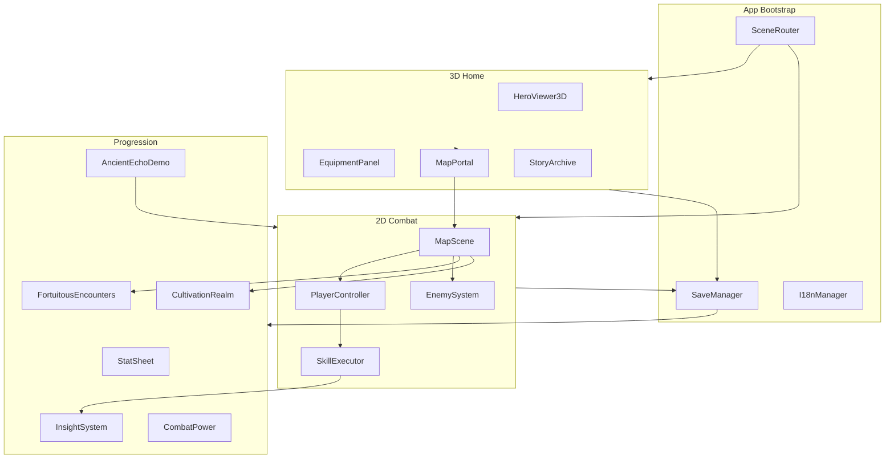

# Path of Dao — Master Implementation Plan

> **Working title:** Path of Dao (candidate names: Void Ascension, Echoes of the Void)  
> **Genre:** Mobile-first 2D Action RPG with 3D Home shrine  
> **Design sources:** `echoes-of-the-void-game-design.md`, `void-ascension-game-concept.md`  
> **Narrative north star:** *Tiên Nghịch* (Renegade Immortal) — mortal beginnings, map-by-map hardship, fortuitous inheritance, and a legendary sword earned late, not given at birth.

---

## 1. Vision Summary

Build a cultivation-themed action RPG where the player:

1. Controls a hero with **one-thumb inputs** (move joystick, attack, skill, dodge) in **2D combat maps**.
2. Returns to a **3D Home** (floating mountain village) to admire their character, manage equipment, review lore, and choose the next map.
3. Grows through **levels, cultivation realms, insight awakenings, and fortuitous encounters** — not just stat inflation.
4. Explores a **non-linear world** of 10 regions / 20 maps; if a map is too hard, they leave, farm elsewhere, and return stronger — the core *Tiên Nghịch* loop of retreat, endure, and seize destiny on the next attempt.
5. Experiences **story at chapter endings** via narrated scenes that read like cultivation diary entries: each region marks a turning point on the road, not a loot checklist.
6. Can optionally **walk as legendary ancients** (*Echoes of the Ancients*) to preview realms, skills, breakthrough, and fortune before their own journey deepens.

The player should always feel: *my character has grown, my realm matters, my aura tells my story, every map hides another destiny.*

### 1.1 Tiên Nghịch Design Pillars (Canonical)

These pillars override generic ARPG defaults when in conflict.

| Pillar | In *Tiên Nghịch* | In Path of Dao |
|--------|------------------|----------------|
| **Humble start** | Wang Lin begins mortal — fists, hardship, ridicule | Hero **attacks unarmed** (palm / body strikes) until a real weapon is earned |
| **Map-by-map road** | Each secret land, ruin, and trial is a chapter of survival | **20 maps** = 10 regions × 2 stages; world map is the cultivation road, not a level select |
| **Fortuitous inheritance** | Power comes from hidden caves, ancient remnants, and risk | **POIs + encounters** gate major rewards; sword is a *destiny*, not starter gear |
| **The sword** | Legendary blade tied to ancient will — transforms the cultivator | **`item.sword.ancient`** (Ancient Spirit Sword) is a **major milestone** unlocked mid-journey via map POI + story beat; Sword Intent skills **require** it |
| **Retreat & return** | Flee, cultivate elsewhere, come back overwhelming | CP badges + rematch scaling on lower maps (§7.5) |
| **Story tone** | Cold perseverance, loss, obsession with dao | Chapter-end scenes: sparse prose, consequence, no power-fantasy quips in early acts |

**Legal note:** We take *structure and feeling* from *Tiên Nghịch* — mortal rise, fortuitous sword, map odyssey — not plot, names, or verbatim text. Original characters, regions, and dialogue only.

---

## 2. MVP Scope (Locked)

| Area | MVP Target | Notes |
|------|-----------|-------|
| Heroes | 1 playable hero | Expand post-MVP |
| **Combat style** | **Unarmed → Ancient Sword** | Default **hand/palm combo**; `item.sword.ancient` earned mid-Act I via map POI (see §7.7) |
| Chapters | 10 | Each ends with story scene; arc follows cultivation road (§7.8) |
| Maps | 20 | 1–2 stages per region; `.01` explore, `.02` ordeal + boss |
| Enemies | 25 types | Shared AI archetypes, unique visuals/stats |
| Bosses | 8 | Gate chapter progression or realm breakthrough |
| Skills | 40 total | 6 signature + variants; **Sword Intent locked** until Ancient Sword acquired |
| Save | Save anywhere | IndexedDB + export/import JSON |
| Locales | `en`, `vi` | All UI + story strings externalized |
| Home | Full feature set | 3D viewer, equipment, skills, bestiary, story archive, map portal |
| Onboarding | Echoes of the Ancients | Guided demo saves — see [plans/27-ancient-echo-demo.md](./plans/27-ancient-echo-demo.md) |
| Platforms | Mobile web (PWA) first | iOS Safari, Android Chrome; desktop secondary |

**Out of MVP:** multiplayer, gacha, IAP, procedural infinite maps, voice acting, full pet combat system (pet preview in Home only).

---

## 3. Technology Stack

### 3.1 Runtime & Build

| Layer | Choice | Rationale |
|-------|--------|-----------|
| Language | TypeScript 5.x | Type safety for RPG data + skill configs |
| Bundler | Vite 6 | Fast HMR, PWA plugin, code-splitting by scene |
| Package manager | pnpm | Monorepo-friendly if tools grow |

### 3.2 Rendering

| Scene | Engine | Rationale |
|-------|--------|-----------|
| 2D maps (combat) | **Phaser 3** | Mature mobile 2D, tilemaps, physics, particles, touch input |
| 3D Home | **Three.js r170+** | Hero viewer, aura VFX, equipment attach points |
| UI overlay | **HTML/CSS** (not Phaser DOM) | Responsive HUD, menus, story reader; easier i18n |
| 2D character art | **Sticky-man pixel** (procedural MVP) | See [docs/pixel-art-style.md](./docs/pixel-art-style.md) — 32×40 frames, 2× display, ≤6 colors |
| Bridge | Custom `SceneRouter` | Single canvas stack; swap Phaser ↔ Three without full page reload |

### 3.3 Data & State

| Concern | Solution |
|---------|----------|
| Game state | Zustand store + immutable snapshots for save |
| Content | JSON/YAML in `content/` — maps, enemies, skills, story |
| Validation | Zod schemas at load time |
| Save | IndexedDB (`idb`) + checksum + version migration |
| Audio | Howler.js |

### 3.4 Testing

| Layer | Tool |
|-------|------|
| Unit | Vitest |
| Integration | Vitest + headless Phaser boot |
| E2E smoke | Playwright (mobile viewport) |

### 3.5 Repo Layout (Target)

```
path-of-dao/
├── master-plan.md
├── plans/                          # Sub-plans (this document's children)
├── content/
│   ├── chapters/
│   ├── maps/
│   ├── enemies/
│   ├── skills/
│   ├── items/
│   ├── encounters/
│   ├── demo/                       # Ancient echo profiles (sub-plan 27)
│   └── locales/{en,vi}/
├── src/
│   ├── app/                        # bootstrap, SceneRouter, PWA
│   ├── core/                       # EventBus, GameClock, SaveManager
│   ├── combat/                     # Phaser scenes, entities, hitboxes
│   ├── home/                       # Three.js shrine scene
│   ├── progression/                # realm, insight, combat power
│   ├── ui/                         # HUD, menus, story reader
│   └── shared/                     # types, math, pooling
├── assets/
│   ├── sprites/
│   ├── models/
│   ├── audio/
│   └── vfx/
├── tools/                          # content validators, CP calculator
└── tests/
```

---

## 4. Core Systems Map



---

## 5. Implementation Phases

Phases are **sequential at the phase level**; sub-plans within a phase can parallelize where noted.

| Phase | Sub-plans | Goal | Depends On |
|-------|-----------|------|------------|
| **0 — Foundation** | `01`–`02` | Runnable shell, routing, empty scenes | — |
| **1 — Core Engine** | `03`–`05` | Input, movement, stats, save stub | Phase 0 |
| **2 — 2D Combat** | `06`–`09` | Player combat loop, enemies, one test map | Phase 1 |
| **3 — 3D Home** | `10`–`12` | Hero viewer, equipment preview, map portal UI | Phase 1 |
| **4 — Progression** | `13`–`16` | Realm, insight, encounters, combat power | Phase 2 |
| **5 — World & Content** | `17`–`20` | World map, chapters, story, content pipeline | Phase 2, 3, 4 |
| **6 — MVP Content** | `21`–`23` | 20 maps, 25 enemies, 8 bosses, 40 skills data | Phase 5 |
| **7 — Polish & Ship** | `24`–`26` | i18n, audio/VFX, PWA, performance | Phase 6 |

**Critical path:** `01 → 03 → 06 → 13 → 17 → 21 → 24`

**Parallel tracks after Phase 1:**
- Track A (combat): `06 → 07 → 08 → 09`
- Track B (home): `10 → 11 → 12`
- Merge at Phase 4–5

---

## 6. Sub-Plan Index

Each file in `plans/` is sized for **1–3 focused implementation sessions** (~4–12 hours each).

| ID | File | Title | Phase |
|----|------|-------|-------|
| 01 | `plans/01-project-scaffold.md` | Project scaffold & tooling | 0 |
| 02 | `plans/02-scene-router-app-shell.md` | Scene router & app shell | 0 |
| 03 | `plans/03-input-touch-controls.md` | One-thumb input & virtual joystick | 1 |
| 04 | `plans/04-stat-sheet-rpg-core.md` | Stat sheet & RPG core formulas | 1 |
| 05 | `plans/05-save-system-foundation.md` | Save system foundation | 1 |
| 06 | `plans/06-phaser-map-scene-base.md` | Phaser map scene base & camera | 2 |
| 07 | `plans/07-player-controller-combat.md` | Player controller & basic combat | 2 |
| 08 | `plans/08-enemy-system-ai.md` | Enemy system & AI archetypes | 2 |
| 09 | `plans/09-hitbox-damage-combat-math.md` | Hitboxes, damage, i-frames | 2 |
| 10 | `plans/10-threejs-home-scene.md` | Three.js home scene & hero viewer | 3 |
| 11 | `plans/11-equipment-3d-preview.md` | Equipment slots & 3D preview | 3 |
| 12 | `plans/12-home-ui-panels.md` | Home UI panels & navigation | 3 |
| 13 | `plans/13-cultivation-realm-system.md` | Cultivation realm & breakthrough | 4 |
| 14 | `plans/14-insight-system.md` | Insight progression & awakenings | 4 |
| 15 | `plans/15-fortuitous-encounters.md` | Fortuitous encounter events | 4 |
| 16 | `plans/16-combat-power-profile.md` | Combat power & character profile | 4 |
| 17 | `plans/17-world-map-travel.md` | World map & free travel | 5 |
| 18 | `plans/18-chapter-story-system.md` | Chapter flow & story scenes | 5 |
| 19 | `plans/19-skill-executor-vfx.md` | Skill executor & cultivation VFX | 5 |
| 20 | `plans/20-content-pipeline.md` | Content pipeline & validators | 5 |
| 21 | `plans/21-mvp-maps-chapters-1-5.md` | MVP maps: chapters 1–5 | 6 |
| 22 | `plans/22-mvp-maps-chapters-6-10.md` | MVP maps: chapters 6–10 | 6 |
| 23 | `plans/23-mvp-enemies-bosses-skills.md` | MVP enemies, bosses, skill data | 6 |
| 24 | `plans/24-localization-en-vi.md` | Localization en + vi | 7 |
| 25 | `plans/25-audio-vfx-polish.md` | Audio, aura VFX, juice | 7 |
| 26 | `plans/26-pwa-performance-ship.md` | PWA, performance, ship checklist | 7 |
| 27 | `plans/27-ancient-echo-demo.md` | Echoes of the Ancients (guided demo) | Cross |

---

## 7. Cross-Cutting Concerns

### 7.1 Combat Power Formula (Canonical)

```
CP = floor(
  HP×0.15 + Mana×0.08 + ATK×2.5 + DEF×2.0
  + Crit×800 + CritDmg×400 + Speed×120 + Spirit×1.5
  + RealmMultiplier×50000
  + InsightBonus
)
```

Realm multipliers and insight bonuses defined in `plans/16-combat-power-profile.md`.

### 7.2 Cultivation Realms (MVP Ladder)

| Order | Realm | Aura Tier |
|-------|-------|-----------|
| 1 | Mortal Body | none |
| 2 | Qi Condensation | none |
| 3 | Foundation Establishment | faint |
| 4 | Core Formation | faint energy |
| 5 | Nascent Soul | swirling |
| 6 | Void Spirit | distorted space |
| 7 | True Dao | reality bend |

Breakthrough requires: level threshold + boss clear OR special encounter + spirit resource cost.

### 7.3 Insight Intents (MVP)

Sword, Void, Flame, Lightning, Time, Life — each skill tagged with one intent. Using tagged skills in combat grants insight XP; at 100%, skill **awakens** (new behavior, not just +damage).

**Tiên Nghịch gating:** Sword Intent skills and sword-flavored attack VFX are **disabled until** the player owns `item.sword.ancient` (Ancient Spirit Sword). Before that, primary attacks use **unarmed palm/strike** animations and physical hitboxes only.

### 7.4 Story Delivery

- **In-map:** minimal — environmental text, NPC barks (optional MVP); POI whispers foreshadow the ancient sword.
- **Chapter end:** full-screen story scene (text + illustration + Continue) — tone: perseverance, cost, quiet resolve (*Tiên Nghịch* diary style).
- **Story Archive:** replay unlocked chapters from Home.

### 7.5 Difficulty & Power Fantasy

Maps have recommended CP range. Returning to lower maps: enemies have `-40% HP/DEF` per realm tier above recommendation; player damage capped only by skill CD — should feel like crushing ants once the dao road is behind you.

### 7.6 Ancient Echo Demo (Onboarding)

**Echoes of the Ancients** — shippable guided demo, not a debug mode. See [`plans/27-ancient-echo-demo.md`](./plans/27-ancient-echo-demo.md).

| Concern | Approach |
|---------|----------|
| Entry | Home → **Echoes** tab, or Play → travel button |
| Walk | **Always enters combat** on the ancient's `startMapId` — power fantasy first |
| Safety | Real save in `sessionStorage` backup; demo skips IndexedDB persist; combat runtime not saved |
| Content | `content/demo/ancients.json` — profile + save template + `visualTheme` per ancient |
| Focus groups | Breakthrough · Awakening · Combat · Fortune · Endgame |
| Combat fantasy | God-mode pools (no damage, infinite mana); HUD shows **∞** only (internal pools tracked in StatSheet) |
| Hero look | Themed sticky-man palette, weapon, clothes, aura, name/epithet tag (`ancientHeroVisuals`) |
| HUD | `AncientEchoBanner` + gold `PlayerStatusBar` ancient mode during demo combat |
| Encounters | Fortuitous encounter rolls **skipped** during demo (no interrupting skill showcase) |
| Locale | `content/locales/{en,vi}/demo.json` |

Each ancient demonstrates one vertical slice with their equipped skills live in combat. Players can exit to Home afterward to explore Cultivate, Awaken, Story archive, etc. with the demo save loaded.

**Key files:** `AncientDemoManager`, `AncientCombatMode`, `EchoesPanel`, `MapScene` (god mode + `applyAncientEcho`), `Player`, `StatSheet.enableGodMode`.

### 7.7 Weapon & Combat Progression (*Tiên Nghịch* Arc)

The hero's relationship to the sword mirrors the novel's slow inheritance — power is **found on the road**, not in the tutorial chest.

| Stage | When | Combat | Equipment | Story beat |
|-------|------|--------|-----------|------------|
| **0 — Mortal body** | Ch1 start (`map.fallen_village.01`) | **3-hit palm combo** — short reach, no blade VFX | No weapon slot filled (or cosmetic wraps only) | Fleeing a ruined homeland; survive with bare hands |
| **1 — Qi awakening** | Ch1 mid (`map.fallen_village.01` POI optional) | Same palms; **Void / Life** intent skills unlock from cultivation | `item.spirit.jade` from story | Jade spirit stirs — dao path opens |
| **2 — Ancient Spirit Sword** | Ch1–2 (`ancient_sword` POI on `map.fallen_village.02` or hidden cave ch2) | **Sword combo replaces palms**; Sword Intent skills enabled; CP jump | `item.sword.ancient` equipped — **signature weapon for rest of MVP** | Blade sleeps in stone; only your spirit awakens it — *the* fortuitous encounter |
| **3 — Tempered road** | Ch3–5 maps | Sword + new intents (Flame, Lightning) | `item.sword.iron` optional side upgrade; ancient sword remains BiS until endgame | Bandits, seals, desert — each region hardens will |
| **4 — Heavenly trials** | Ch6–10 | Full skill roster + awakenings | Endgame spirit accessories; sword awakens visually at Nascent Soul+ | Tribulation, abyss, gate, void throne |

**Implementation rules:**

1. **New game:** `equipped.weapon = null`; starter loadout has **no** `item.sword.wood` in weapon slot (training blade may exist in inventory as junk later).
2. **`PlayerAnimController`:** `attackStyle: 'unarmed' | 'sword'` driven by save flag `progress.weaponMilestone` or equipped ancient sword.
3. **`ancient_sword` POI** (`encounter.ancient_sword`): grants `item.sword.ancient`, sets milestone, plays sting + story shard, unlocks Sword Intent on skill picker.
4. **Echoes demo** ancients may still show sword — they preview endgame fantasy, not the player's start.

**Content IDs:** `item.sword.ancient`, POI type `ancient_sword`, encounter `encounter.ancient_sword`, flag `progress.weaponMilestone: 'none' | 'ancient_sword'`.

### 7.8 World Road — Map & Chapter Arc (*Tiên Nghịch* Style)

Each chapter is a **stop on the cultivation road**. Player picks the next destination from the world map (free travel); difficulty pushes them to farm earlier regions first.

| Ch | Region | *Tiên Nghịch* parallel (structure only) | Map .01 — Explore | Map .02 — Ordeal | Story theme |
|----|--------|-------------------------------------------|-------------------|------------------|-------------|
| 1 | Fallen Village | Mortal homeland destroyed | Ruins, slimes — learn dodge | Bandits + Jade Guardian | Awakening — jade spirit, **sword destiny teased** |
| 2 | Mist Forest | Wilderness after exile | Spirit beasts, fog | Mist Stalker boss | Fox spirit / hidden path — **ancient sword POI** (if not taken ch1) |
| 3 | Stone Canyon | Trials among mortals & bandits | Patrol routes | Bandit Lord | Ruthless choices; dao or death |
| 4 | Moon Lake | Ancient seal / forbidden ruin | Water sprites | Seal Warden | Ancient seal cracks — corruption foreshadowed |
| 5 | Burning Desert | Endurance, near breaking | Scorpions, heat | Desert Sovereign | Survival — will tempered by sand |
| 6 | Thunder Peaks | Heavenly tribulation | Storm hawks | Thunder Avatar | Lightning intent — heaven tests the stubborn |
| 7 | Frozen Palace | Memory of power / loss | Ice shades | Frost Queen | Past life echoes; cold dao |
| 8 | Abyss Rift | Inner demon / rift walk | Void shades | Rift Horror | Corruption of heart; void deepens |
| 9 | Heavenly Gate | Ascension trial | Gate sentinels | Gate Keeper | Guardians of the threshold |
| 10 | Void Throne | Ultimate dao confrontation | Celestial path | Void Emperor | Epilogue — what remains after obsession |

**Map flow (every chapter):**

```
World Map → pick region → Map .01 (explore, POIs, farm) → Map .02 (boss) → Chapter story → unlock next region
                ↑___________________________________________|  (retreat anytime if CP too low)
```

**POI distribution (minimum):** 1× `hidden_cave` + 1× `ancient_sword` across ch1–2; 1× `secret_manual` by ch5; fortuitous tables per region in `content/encounters/fortuitous/`.

---

## 8. Data Model Overview

### 8.1 Player Save (`PlayerSave` v1)

```typescript
interface PlayerSave {
  version: number;
  heroId: string;
  stats: StatSheet;
  realm: CultivationRealmState;
  insights: Record<InsightId, InsightState>;
  inventory: InventoryState;
  equipped: EquipmentSlots;
  progress: {
    clearedMaps: string[];
    clearedBosses: string[];
    unlockedChapters: string[];
    storySeen: string[];
    encountersFound: string[];
    weaponMilestone: 'none' | 'ancient_sword';  // Tiên Nghịch sword gate
  };
  meta: {
    totalPlaySeconds: number;
    yearsCultivated: number;  // derived flavor stat
    createdAt: string;
    updatedAt: string;
  };
}
```

### 8.2 Content IDs Convention

- Maps: `map.{chapter}.{stage}` → e.g. `map.fallen_village.01`
- Enemies: `enemy.{family}.{variant}` → e.g. `enemy.bandit.swordsman`
- Skills: `skill.{intent}.{name}` → e.g. `skill.void.slash`
- Chapters: `chapter.{number}.{slug}` → e.g. `chapter.01.fallen_village`

---

## 9. Quality Gates (Per Sub-Plan)

Every sub-plan must satisfy before marking done:

1. **Acceptance criteria** in the sub-plan — all checked.
2. **No TypeScript errors** — `pnpm typecheck` passes.
3. **Unit tests** — new logic has Vitest coverage where specified.
4. **Mobile viewport** — manually verified at 390×844 if UI/touch involved.
5. **Save compat** — if touching save schema, migration test added.

---

## 10. Risk Register

| Risk | Impact | Mitigation |
|------|--------|------------|
| Phaser + Three.js memory on mobile | Crashes on low-end devices | SceneRouter disposes inactive engine; quality profiles |
| 40 skills × unique VFX scope | Schedule blow-up | Skill executor uses composable effect primitives; data-driven |
| Content authoring bottleneck | 20 maps delayed | Tiled + JSON pipeline; reuse tilesets per region |
| Save corruption | Player rage-quit | Checksum, autosave rotation, export backup |
| i18n string overflow (Vietnamese) | UI breaks | Flexible layouts, max-width tokens, test both locales early |
| Insight system complexity | Over-engineering | MVP: 6 base skills + 6 awakenings; expand to 40 via variants in Phase 6 data |
| **Tiên Nghịch alignment rework** | Player expects sword from minute one; undermines story | §7.7 weapon arc; TRACK T1–T8; unarmed animations before ancient sword POI |
| Art consistency | Characters feel disconnected | Locked sticky-man style guide: [docs/pixel-art-style.md](./docs/pixel-art-style.md) |

---

## 11. Recommended Implementation Order

For a solo developer or small team, execute sub-plans in numeric order. Safe parallelization pairs:

| After completing | Can start in parallel |
|------------------|----------------------|
| `05` | `06` (combat) + `10` (home) |
| `09` | `13`, `14`, `15` (all progression) |
| `12` + `09` | `17`, `18`, `19` |
| `13`–`15` | `27` (Ancient Echo demo — parallel onboarding) |
| `20` | `21`, `22`, `23` (content authoring) |

---

## 12. Definition of Done (MVP Ship)

- [ ] Player can: boot → Home → pick map → combat → clear/fail → save → return Home
- [ ] **New game starts unarmed** — palm combo only; no sword in weapon slot
- [ ] **Ancient Spirit Sword** obtainable from map POI (ch1–2); equipping enables sword combo + Sword Intent
- [ ] All 10 chapters playable with end-of-chapter story scene (*Tiên Nghịch* tone pass on all story JSON)
- [ ] 20 maps traversable from world map with difficulty hints; map-to-map road readable in UI
- [ ] 8 boss fights with distinct patterns
- [ ] 40 skills equippable; Sword Intent **gated** until ancient sword; at least 6 with full awakening VFX
- [ ] Insight meter visible; one awakening demonstrable per intent
- [ ] At least 3 fortuitous encounter types functional (including ancient sword)
- [ ] Realm breakthrough flow works once
- [ ] Combat power displayed in Home profile
- [ ] Aura visible in 3D Home per realm tier
- [ ] Save anywhere (pause menu + autosave on map exit)
- [ ] Full UI in English and Vietnamese
- [ ] PWA installable; 30 FPS on mid-range Android
- [ ] No console errors in 10-minute playthrough
- [x] Echoes of the Ancients — six focused demo walks; combat-first with god-mode power fantasy (sub-plan 27)

---

## 13. Next Step

Start with **`plans/01-project-scaffold.md`**. Each sub-plan links `Depends on` / `Blocks` and includes file-level implementation steps, test cases, and acceptance criteria.

**Active design thread:** Align implementation with **§1.1 Tiên Nghịch pillars** — see [TRACK.md](./TRACK.md) § Tiên Nghịch Alignment for gap list and owning sub-plans.
