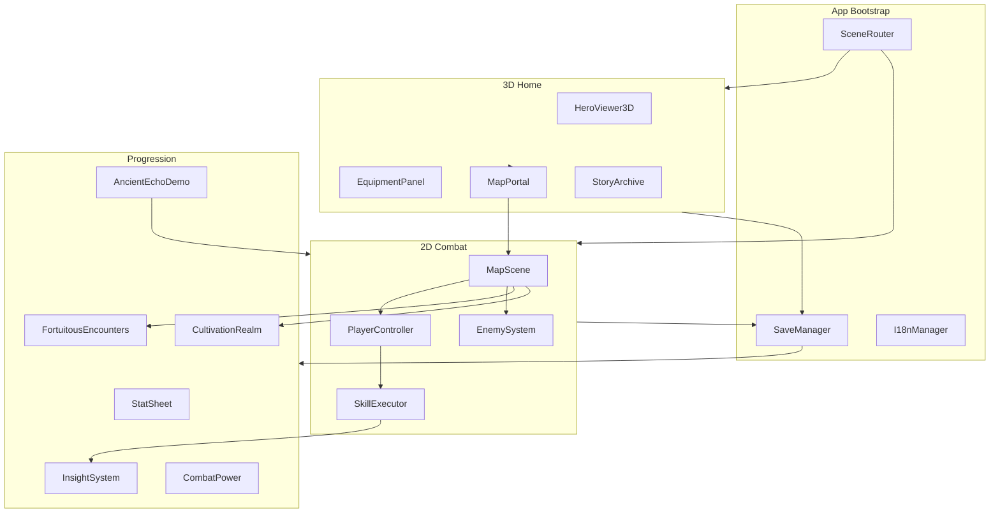
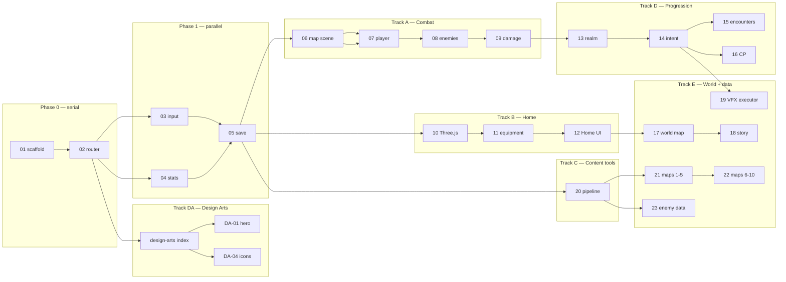

# Path of Dao — Master Implementation Plan

> **Working title:** Path of Dao (candidate names: Void Ascension, Echoes of the Void)  
> **Genre:** Mobile-first 2D Action RPG with 3D Home shrine — **landscape primary** (§2.1)
> **Design sources:** `echoes-of-the-void-game-design.md`, `void-ascension-game-concept.md`  
> **Narrative north star:** [*Renegade Immortal*](../handbook/renegade-immortal-reference.md) — **Wang Lin's road exactly**: same story spots, map stops, and cultivation beats (mortal beginnings, map-by-map hardship, fortuitous inheritance, legendary sword earned late).

> **Vocabulary canon:** the three pillars of cultivator power are the player-facing nouns
> everywhere — **Master Intent (Ý Cảnh)** (was "Insight"), **Divine Arts (Thần Thông)** (was
> "Skills"), **Dharma Treasures (Pháp Bảo)** (was "Items/Equipment"). Content IDs (`skill.*`,
> `item.*`) stay as internal identifiers; see §1.2 and §7.3 below.

> **Progress:** [`tracks/index.md`](../tracks/index.md) · **Plans are the sole design source of truth** (`plans/` only — `planning/` retired 2026-07).

---

## 1. Vision Summary

Build a cultivation-themed action RPG where the player:

1. Controls a hero with **one-thumb inputs** (move joystick, attack, skill, dodge) in **2D combat maps**.
2. Returns to a **3D Home** (floating mountain village) to admire their character, manage equipment, review lore, and choose the next map.
3. Grows through **levels, cultivation realms, insight awakenings, and fortuitous encounters** — not just stat inflation.
4. Explores a **non-linear world** of 10 regions / 20 maps; if a map is too hard, they leave, farm elsewhere, and return stronger — the core *Renegade Immortal* loop of retreat, endure, and seize destiny on the next attempt.
5. Experiences **story on every map** via the **Dao Scroll** (Wang Lin timeline: image + punch-line Intent lesson per map) and **chapter-ending** narrated scenes — cultivation diary, not a loot checklist. See [`plans/31-wang-lin-story-timeline.md`](./31-wang-lin-story-timeline.md).
6. Can optionally **walk as legendary ancients** (*Echoes of the Ancients*) to preview realms, skills, breakthrough, and fortune before their own journey deepens.

The player should always feel: *my character has grown, my realm matters, my aura tells my story, every map hides another destiny.*

### 1.1 Renegade Immortal Design Pillars (Canonical)

These pillars override generic ARPG defaults when in conflict.

| Pillar | In *Renegade Immortal* | In Path of Dao |
|--------|------------------|----------------|
| **Humble start** | Wang Lin begins mortal — fists, hardship, ridicule | Hero **attacks unarmed** (punches, kicks, body strikes) until a real weapon is earned |
| **Map-by-map road** | Each secret land, ruin, and trial is a chapter of survival | **20 maps** = 10 regions × 2 stages; world map is the cultivation road, not a level select |
| **Fortuitous inheritance** | Power comes from hidden caves, ancient remnants, and risk | **POIs + encounters** gate major rewards; sword is a *destiny*, not starter gear |
| **The sword** | Legendary blade tied to ancient will — transforms the cultivator | **`item.sword.ancient`** (Ancient Spirit Sword) is a **major milestone** unlocked mid-journey via map POI + story beat; Sword Intent skills **require** it |
| **Retreat & return** | Flee, cultivate elsewhere, come back overwhelming | CP badges + rematch scaling on lower maps (§7.5) |
| **Story tone** | Cold perseverance, loss, obsession with dao | Chapter-end scenes: sparse prose, consequence, no power-fantasy quips in early acts |

**Story canon:** Path of Dao follows **Wang Lin's road exactly** — the same story spots, map
stops, and cultivation beats as *Renegade Immortal* (仙逆), not a loose "similar" homage. Mortal
rise, fortuitous sword, map odyssey, and the Master Intent arc are pinned to his timeline.
**Story reference for agents:** [handbook/renegade-immortal-reference.md](../handbook/renegade-immortal-reference.md) · skill: `renegade-immortal`

**Legal:** During development we treat the novel as the canonical story source. **At publish**, we
will seek the author's permission for content usage — rights are not assumed cleared until then.

### 1.2 Cultivator Identity — the three pillars (Canonical)

The whole game speaks three nouns. These **replace** generic "skills" and "items" in UI, code
types, story, and store copy. The locale layer already ships them; code and content follow.

| Pillar | What it is | Key behavior |
|--------|-----------|--------------|
| **Master Intent (Ý Cảnh)** | The cultivator's comprehension/domain — **six Intents in two flows:** **main** (3, sequential — Wang Lin's arc): Life-and-Death → Cause-and-Effect → Truth-and-Falsehood; **gate** (3, independent — map/boss unlocks): Sword, Flame, Lightning | **Emergent, not chosen.** Deepens from the Divine Arts you actually use in combat; at a comprehension threshold the Intent's arts **awaken** (new behavior + VFX, not just +dmg). Main-flow Intents require the previous one **awakened** before casting; gate Intents unlock when their road milestone opens (Sword → Ancient Spirit Sword; Flame → ch5 boss; Lightning → ch6 boss). Dao Scroll (plan 31) teaches the **main-flow** curriculum on the timeline. |
| **Divine Arts (Thần Thông)** | Active techniques earned on the road (POIs, ordeals, encounters) | Each belongs to one Intent; each has a **base + awakened** form. Cast from the 6-slot wheel. |
| **Dharma Treasures (Pháp Bảo)** | Artifacts / spirit gear / relics (was "items/equipment") | One of **three** stat sources (base×level × realm multiplier × treasure modifiers). Signature: the Ancient Spirit Sword, earned mid-journey. |

**The loop the player feels:** equip treasures + arts → fight → my Intent deepens → my arts
awaken → I hit harder and look cooler → I return and crush an earlier map. (The xianxia
realm → bottleneck → breakthrough → awakening → *return-and-crush* loop, on our nouns.)

**Combat control model** (one-thumb; left joystick + right cluster; **landscape mobile**):

- **6-slot combat wheel** — equip up to **6 Divine Arts** into named slots (`primary, secondary,
  ultimate, skill3, skill4, skill5`); no duplicates. `null` = empty slot (visible on wheel, not
  castable). Edit at Home (hero) or Echoes modal (ancient); combat wheel mirrors save — see
  [`plans/30-divine-arts-wheel-loadout.md`](./30-divine-arts-wheel-loadout.md).
- **Dash** — dedicated always-available button: fast move + **dodge with i-frames**
  (~0.35 s roll, invuln first ~250 ms). Not a wheel slot.
- **Gather Qi (Vận Khí)** — dedicated always-available: **Buddha meditation sit** — hold to
  channel; **qi air-flow** VFX feeds HP + mana at **3×** base regen. **Slow walk** regens at
  **1×** base (scaled by level). **Hit** → cancel channel, return to **idle**. Vulnerable while
  sitting (extra damage). Not a wheel slot. Spec: plan `07` §7.1 · `04` §7.1.
- **Defeat, not kill** — cultivator opponents (and the player) are **defeated** at 0 HP, return to
  **origin**, and **gather qi** to recover. Bosses take much longer. No permakill cultivators.
  [`combat-defeat-canon.md`](combat-defeat-canon.md).
- **Move stick Y** — thumb up = walk up (same sign as ArrowUp); do not double-invert screen Y
  (plan 03 §5.2).
- **Combat menu** — top-right button opens popup: **Pause** (freeze + resume) and **Back to Home**
  (save + return to shrine). Required on mobile; no keyboard dependency (plan 03 §6).
- **FPS overlay** — always-on button showing live FPS; **left of menu** when menu is present,
  viewport top-right otherwise (plan `02` §4.1 · plan `03` §6.1).
- **Humble start** — 3-hit **unarmed** combo until the Ancient Spirit Sword; only **Life-and-Death** (main-flow first) castable at start — Sword / Flame / Lightning gate Intents locked until their milestones.

> Naming reconciliation: content IDs stay `skill.*` / `item.*` (internal, invisible to players);
> the player-facing nouns come from locale keys (`home.divine.*`, `intent.*`, `home.dharma.*`,
> already present). Keep `content/locales/glossary.md` in sync. Full vocabulary map: §1.2 · §7.3.

---

## 2. MVP Scope (Locked)

| Area | MVP Target | Notes |
|------|-----------|-------|
| Heroes | 1 playable hero | Expand post-MVP |
| **Combat style** | **Unarmed → Ancient Sword** | Default **3-hit unarmed combo** (`hero_strike_*` — random light punch/kick + heavy finisher); `item.sword.ancient` earned mid-Act I via map POI (see §7.7) |
| **Combat controls** | **6-slot wheel + Dash + Gather Qi + menu** | Wheel + Dash + Gather Qi + **combat menu** (Pause · Back Home) — landscape touch only; §1.2 · §2.1 |
| Chapters | 10 | Each map has a **timeline shard** (plan 31); each chapter ends with a full story scene (plan 18) |
| Maps | 20 | 1–2 stages per region — **100×** stub scale (`16,000×12,160` px), settlements (house/village), **signature big tree** per map, unique environment ([`map-design-canon.md`](map-design-canon.md)) |
| Enemies | 25 types | Shared AI archetypes, unique visuals/stats |
| Bosses | 8 | Gate chapter progression or realm breakthrough |
| **Divine Arts** | 40 total | 6 signature + variants (base + awakened); equip 6 to the wheel; main-flow Intents sequential; **gate Intents** (Sword / Flame / Lightning) locked until road milestones |
| Save | Save anywhere | IndexedDB + export/import JSON |
| Locales | `en`, `vi` | All UI + story strings externalized |
| Home | Full feature set | 3D viewer, equipment, skills, bestiary, story archive, map portal |
| Onboarding | Echoes of the Ancients | Guided demo saves — see [plans/27-ancient-echo-demo.md](./plans/27-ancient-echo-demo.md) |
| Platforms | Mobile web (PWA) first | **Landscape primary** (§2.1); iOS Safari, Android Chrome; desktop = dev/smoke |

**Out of MVP:** multiplayer, gacha, IAP, procedural infinite maps, voice acting, full pet combat system (pet preview in Home only).

### 2.1 Mobile landscape — primary design target

**Landscape is the required ship orientation** for both **Home** and **Combat**. Portrait is a
degraded fallback only — never design combat or Home around portrait-first layouts.

| Context | Canonical viewport | Layout |
|---------|-------------------|--------|
| **Combat** | **844×390** (landscape phone) | Full-width Phaser stage; joystick bottom-left; action cluster bottom-right; **FPS + menu top-right** (`[FPS][Menu]`, plan 03 §6) |
| **Home** | **844×390** or wider | Horizontal `\|nav\| · \|3D\| · \|panel\|` (plan 12 §2) |
| **Dev / CI smoke** | Desktop browser + keyboard | Keyboard is **not** a player-facing control — dev convenience only (plan 03 §8) |
| Portrait fallback | 390×844 | Home compact stack; combat still touch-only (no keyboard assumption) |

**Input canon on ship builds:**

- Touch + on-screen buttons only — virtual joystick, action cluster, **combat menu** (Pause · Back Home).
- **No keyboard** in production mobile UX; do not hide exit/pause behind keys or dev-only shortcuts.
- QA and acceptance: verify at **844×390 landscape** before portrait.

PWA manifest may list `orientation: "any"` so devices rotate freely; **design reviews use landscape**.

---

## 3. Technology Stack

### 3.1 Runtime & Build

| Layer | Choice | Rationale |
|-------|--------|-----------|
| Language | TypeScript 5.x | Type safety for RPG data + skill configs |
| Bundler | Vite 6 | Fast HMR, PWA plugin, code-splitting by scene |
| Package manager | pnpm | Monorepo-friendly if tools grow |

### 3.2 Rendering

| Scene | Engine | Rationale |
|-------|--------|-----------|
| 2D maps (combat) | **Phaser 3.60+** | **Fake 2.5D** combat — y-sort, shadows, parallax; **Mobile Pipeline** on |
| 3D Home | **Three.js r170+** | Hero viewer, aura VFX, equipment attach points |
| UI overlay | **HTML/CSS** (not Phaser DOM) | Responsive HUD, menus, story reader; easier i18n |
| 2D character art | **Sticky-man pixel** (procedural until DA ships) | [handbook/pixel-art-style.md](../handbook/pixel-art-style.md) (rig) · **[design-arts/](design-arts/index.md)** (author sprites) · **[plan 29](29-pixel-art-combat-canon.md)** (combat hooks) |
| Bridge | Custom `SceneRouter` | Single canvas stack; swap Phaser ↔ Three without full page reload |

**Fake 2.5D (combat):** Path of Dao’s **2.5D pixel-art** world on **Phaser 3.60+** — orthographic
camera (no rotation), `setDepth(baseY)` y-sort, **layered props** (roof/walls/trunk/canopy),
sprite shadows, optional **Light2D**, camera-locked parallax. Reads like HD-2D; **not** a 3D engine
in combat (Three.js = Home only). Full canon:
[`plans/fake-2.5d.md`](fake-2.5d.md) · depth stack + camera: [`plans/29-pixel-art-combat-canon.md`](29-pixel-art-combat-canon.md) §2 ·
MapScene: plan `06`.

**Engine:** Phaser **3.60+** (repo: `^3.80.0`) confirmed after 2026-07 re-evaluation; mobile perf is
overdraw, draw calls, and GC — ship disciplines in [`plans/26-pwa-performance-ship.md`](26-pwa-performance-ship.md).

**Pixel art:** sprite/icon authoring — [`plans/design-arts/index.md`](design-arts/index.md) (plan 32, start after `02`); combat integration — [`plans/29-pixel-art-combat-canon.md`](29-pixel-art-combat-canon.md); rig/proportions in handbook.

### 3.6 VFX & juice tiers

Near-zero-cost juice (hit-stop, shake, flash, telegraphs) plus three VFX engine tiers — **Common**
/ **Signature** / **Showcase** — defined in [`vfx-juice-tiers.md`](vfx-juice-tiers.md)
and applied per Divine Art in [`plans/29-pixel-art-combat-canon.md`](./29-pixel-art-combat-canon.md) §3.
Echoes god-mode and v5 arts are the primary **Showcase** consumers (sub-plan 27).

**Combat camera UX:** dynamic **zoom in** on attack/cast (Engage / Dramatic framing) and **zoom out**
when the player moves again after combat — integer zoom only, shake scaled to skill power. Full
state machine, timings, and event contract: [`plans/29-pixel-art-combat-canon.md`](./29-pixel-art-combat-canon.md) §2.6.
Implemented via `CombatCameraController` (sub-plan 06) driven by player state (07) and
`ArtExecutor` (19).

### 3.7 Data & State

| Concern | Solution |
|---------|----------|
| Game state | Zustand store + immutable snapshots for save |
| Content | JSON/YAML in `content/` — maps, enemies, skills, story |
| Validation | Zod schemas at load time |
| Save | IndexedDB (`idb`) + checksum + version migration |
| Audio | Web Audio (procedural MVP) + `localStorage` unlock | Howler.js when OGG assets ship; first-visit tap overlay only |

### 3.8 Testing

| Layer | Tool |
|-------|------|
| Unit | Vitest |
| Integration | Vitest + headless Phaser boot |
| E2E smoke | Playwright (mobile viewport) |

### 3.9 Repo Layout (Target)

```
path-of-dao/
├── plans/
│   ├── fake-2.5d.md                # Fake 2.5D combat depth canon (Phaser 3.60+)
│   ├── map-design-canon.md         # Map scale, settlements, signature trees
│   ├── vfx-juice-tiers.md          # VFX engine tiers + overdraw budget
│   ├── combat-defeat-canon.md      # Defeat not kill; gather-qi recovery
│   ├── index.md                    # Master implementation plan (this document)
│   └── …                           # Sub-plans (01–31)
├── content/
│   ├── chapters/
│   ├── maps/
│   ├── enemies/
│   ├── skills/
│   ├── items/
│   ├── encounters/
│   ├── demo/                       # Ancient echo profiles (sub-plan 27)
│   └── locales/{en,vi}/
├── src/
│   ├── app/                        # bootstrap, SceneRouter, PWA
│   ├── core/                       # EventBus, GameClock, SaveManager
│   ├── combat/                     # Phaser scenes, entities, hitboxes
│   ├── home/                       # Three.js shrine scene
│   ├── progression/                # realm, insight, combat power
│   ├── ui/                         # HUD, menus, story reader
│   └── shared/                     # types, math, pooling
├── assets/
│   ├── sprites/
│   ├── models/
│   ├── audio/
│   └── vfx/
├── tools/                          # content validators, CP calculator
└── tests/
```

---

## 4. Core Systems Map



---

## 5. Implementation Phases

### 5.0 Baseline + hook-up (parallel by default)

Most features are **two layers** that ship independently:

| Layer | What | When |
|-------|------|------|
| **Baseline logic** | Schema, managers, roll algorithms, EventBus contracts, UI with placeholders | As soon as save/router exist |
| **Attachables** | Pixel PNGs, 3D GLB, locale copy, balance tuning, polish juice | Anytime in parallel |

**Rules:**

1. **IDs are contracts** — `item.*`, `skill.*`, `enemy.*`, `loot.*` referenced in JSON work before art exists.
2. **Hook, don't block** — missing icon/GLB/sprite logs a validator **warning**, not a runtime crash.
3. **One event surface** — `inventory:changed`, `equipment:changed`, `combat:loot`, etc. let UI/3D/combat subscribe when ready ([`item-system/hook-up.md`](item-system/hook-up.md)).
4. **Directory tracks** for big parallel areas:
   - **Sprites/icons:** [`design-arts/`](design-arts/index.md) (plan 32) — gate `02`
   - **Item pixels:** [`design-arts/items/`](design-arts/items/index.md) — gate `02`
   - **Item logic:** [`item-system/`](item-system/index.md) (plan 33) — gate `05`

```
Gate 02 ──► design-arts/ (hero, enemies, items/icons, …)  ──┐
Gate 05 ──► item-system/ (drops, random, equip)  ────────────┼──► hook at EventBus + ContentLoader
         ──► 06–12 code tracks  ──────────────────────────────┘
```

Phases below are **integration gates**, not “finish all art before combat.”

---

Phases are **sequential at the phase level** only. **Most sub-plans inside and across phases can
run in parallel** once their *hard* dependencies are met. Numeric order is a safe default for one
person; teams and agents should use §5.1 workstreams instead.

| Phase | Sub-plans | Goal | Hard gate (must finish first) |
|-------|-----------|------|-------------------------------|
| **0 — Foundation** | `01`–`02` | Runnable shell, routing, empty scenes | — |
| **1 — Core Engine** | `03`–`05` | Input, stats, save stub | Phase 0 |
| **2 — 2D Combat** | `06`–`09` | Player combat loop, enemies, one test map | `05` (save) + `02` (router) |
| **3 — 3D Home** | `10`–`12` | Hero viewer, equipment preview, Home UI | `05` + `02` (parallel with Phase 2) |
| **4 — Progression** | `13`–`16` | Realm, insight, encounters, combat power | `09` (combat math) |
| **5 — World & Content** | `17`–`20` | World map, chapters, story, validators | Phase 2 + 3 + 4 (partial — see §5.1) |
| **6 — MVP Content** | `21`–`23` | 20 maps, 25 enemies, 8 bosses, 40 skills data | `20` validators + combat/home shells |
| **7 — Polish & Ship** | `24`–`26` | i18n, audio/VFX, PWA, performance | Phase 6 (soft — polish can start earlier) |

**Critical path** (longest chain if done serially):  
`01 → 02 → 04 → 05 → 06 → 07 → 09 → 13 → 14 → 17 → 21 → 24 → 26`

**Not on the critical path** (safe to parallelize): Home track `10–12`, content pipeline `20`,
cross-cutting `27–31`, most of Phase 7 polish, and content authoring splits `21`/`22`/`23`.

### 5.1 Parallel workstreams

After Phase 0, treat the MVP as **five concurrent tracks** that merge at integration gates.
Assign different people/agents to different tracks; only coordinate at **contract boundaries**
(§5.2).



| Track | Sub-plans | Starts after | Runs parallel with |
|-------|-----------|--------------|-------------------|
| **A — Combat** | `06 → 07 → 08 → 09` | `05` | Track B, C, **DA**; `03` must finish before `07` |
| **B — Home** | `10 → 11 → 12` | `05` | Track A, C, **DA**; `04` before `11` |
| **C — Content tools** | `20` | `05` | Tracks A, B, **DA** — **start early** |
| **DA — Design Arts** | [`design-arts/`](design-arts/index.md) DA-01…08 | **`02`** | **All code tracks** — hero/icons first; auto-wire on drop |
| **IS — Item system** | [`item-system/`](item-system/index.md) IS-01…06 | **`05`** | `11`, `15`, `20`, **`design-arts/items/`** |
| **D — Progression** | `13 → 14 → 15`, then `16` | `09` (`13`); `14` needs `13`; `16` needs `11+13+14`) | `19` after `14`; `27` after `15` |
| **E — World & MVP data** | `17 → 18`; `19`; `21 ∥ 22 ∥ 23` | `17` after `12+16+06`; `19` after `07+09+14`; content after `20` | Split `21`/`22`/`23` across authors |

**Cross-cutting** (parallel to any track once deps met):

| ID | Plan | Parallel when | Notes |
|----|------|---------------|-------|
| `27` | Ancient Echo demo | `13–15` done | Onboarding showcase; does not block MVP maps |
| `28` | Path & Journey | `17+18+27` | My Path + follow ancients |
| `29` | Combat visual integration | `06+` | Hooks, camera, hitboxes — consumes design-arts |
| `30` | Divine Arts wheel loadout | `03+12+14` | Contract: 6 slot names + save shape |
| `31` | Wang Lin timeline | `18+17+28` | Content + Home Path panel; art ∥ `21–22` |
| **`32`** | **[Design Arts](design-arts/index.md)** | **`02`** | **First parallel art track** — hero, icons, enemies, bosses; auto-wire DA-08 |
| `34` | Quick check (smoke + DevTools) | `02` + smoke runner | Run before batch hand-off — [`34-quick-check-smoke-devtools.md`](34-quick-check-smoke-devtools.md) |

### 5.2 Contract boundaries (coordinate, don't collide)

Parallel work is safe **unless** two streams edit the same contract without agreement. Pause and
sync when touching:

| Contract | Owner plan | Consumers | Rule |
|----------|------------|-----------|------|
| `PlayerSave` schema | `05` | all | Migration + version bump in same PR as schema change |
| `skill.*` / `item.*` IDs | `20` | `21–23`, `19`, `33` | Add IDs in content first; validators must pass |
| `loot.*` table IDs | `33` / `item-system` | `08`, `15`, `21–23` | Entries reference valid `item.*` |
| 6-slot wheel slot names | `30` | `03`, `07`, `12`, `27` | `primary…skill5` — no 7th slot |
| Combat control model | `03` | `07`, `19` | Wheel + Dash + Gather Qi — not negotiable per §1.2 |
| **Fake 2.5D** (Phaser 3.60+) | [`fake-2.5d.md`](fake-2.5d.md) · `06` | `07`–`09`, `21`–`22`, `29`, DA-09 | y-sort, layered props, Light2D (quality-gated), sprite shadows; Three.js = Home only |
| **Map world canon** | [`map-design-canon.md`](map-design-canon.md) · `20` | `06`, `17`, `21`–`22`, DA-09 | 16k×12k bounds; ≥1 settlement; one `signatureTree`; unique `environment` per map |
| Asset paths + `animKey` / `textureKey` | [`design-arts/08`](design-arts/08-auto-wire-pipeline.md) | `06`, `07`, `08`, `29` | Drop PNG → manifest; new keys need 29 + code sync |
| Item `iconKey` / sprite path | [`design-arts/items/`](design-arts/items/index.md) | `12`, `11`, `33` | Missing PNG = warn; loot/equip still runs |
| Locale keys | `24` | all UI plans | Add key when adding UI; vi overflow test at 640px |
| Home horizontal shell | `12` | `17`, `27`, `28`, `31` | `\|nav\|·\|3D\|·\|panel\|` — panel bodies plug in |

Everything else (panel copy, enemy AI tuning, VFX tier, map tile art) is **embarrassingly parallel**.

### 5.3 Parallel bands (quick reference)

Use this table when spinning up multiple agents or devs:

| Band | Unblock gate | Start together |
|------|--------------|----------------|
| **Band 1** | `02` | `03` input + `04` stats + **`32` design-arts kickoff** |
| **Band 2** | `05` | `06` combat scene + `10` home scene + `20` validators + **`33` item-system** + DA-01 hero ∥ DA-04/05 icons |
| **Band 3** | `07` + `10` | `08` enemies + `11` equipment + `19` VFX (if `14` started) |
| **Band 4** | `09` + `12` | `13` realm + `17` world map + `27` echoes (if `15` ready) |
| **Band 5** | `20` | `21` maps ch1–5 + `23` enemy/skill data + `31` timeline content |
| **Band 6** | `21` | `22` maps ch6–10 + `24` vi strings + **DA-02/03 enemy/boss art** |
| **Band 7** | `21–23` | `25` audio/juice + `26` PWA perf + **DA-07 VFX sheets** + manual ship QA |

Within a band, **merge order does not matter** until an integration test fails — then use the
critical path chain to see who is blocking whom.

---

## 6. Sub-Plan Index

Each file in `plans/` is sized for **1–3 focused implementation sessions** (~4–12 hours each).
**Parallel column** lists safe concurrent work once the plan's hard deps are met (see §5.1).

| ID | File | Title | Phase | Parallel with |
|----|------|-------|-------|---------------|
| 01 | `plans/01-project-scaffold.md` | Project scaffold & tooling | 0 | — (start here) |
| 02 | `plans/02-scene-router-app-shell.md` | Scene router & app shell | 0 | — (after 01) |
| 03 | `plans/03-input-touch-controls.md` | One-thumb input & virtual joystick | 1 | `04` |
| 04 | `plans/04-stat-sheet-rpg-core.md` | Stat sheet & RPG core formulas | 1 | `03` |
| 05 | `plans/05-save-system-foundation.md` | Save system foundation | 1 | — (after 03+04) |
| 06 | `plans/06-phaser-map-scene-base.md` | Phaser map scene base & camera | 2 | `10`, `20` |
| 07 | `plans/07-player-controller-combat.md` | Player controller & basic combat | 2 | `11` (after 03+06) |
| 08 | `plans/08-enemy-system-ai.md` | Enemy system & AI archetypes | 2 | `11`, `12`, `13` |
| 09 | `plans/09-hitbox-damage-combat-math.md` | Hitboxes, damage, i-frames | 2 | `12`, `13` |
| 10 | `plans/10-threejs-home-scene.md` | Three.js home scene & hero viewer | 3 | `06`, `20` |
| 11 | `plans/11-equipment-3d-preview.md` | Equipment slots & 3D preview | 3 | `08`, `07` |
| 12 | `plans/12-home-ui-panels.md` | Home UI panels & navigation | 3 | `08`, `09`, `13` |
| 13 | `plans/13-cultivation-realm-system.md` | Cultivation realm & breakthrough | 4 | `17` (after 09) |
| 14 | `plans/14-insight-system.md` | Insight progression & awakenings | 4 | `19` (after 13) |
| 15 | `plans/15-fortuitous-encounters.md` | Fortuitous encounter events | 4 | `27` (after 14) |
| 16 | `plans/16-combat-power-profile.md` | Combat power & character profile | 4 | `17` (after 13+14) |
| 17 | `plans/17-world-map-travel.md` | World map & free travel | 5 | `18`, `19`, `21` |
| 18 | `plans/18-chapter-story-system.md` | Chapter flow & story scenes | 5 | `19`, `31` (after 17) |
| 19 | `plans/19-skill-executor-vfx.md` | Skill executor & cultivation VFX | 5 | `17`, `21`, `23` |
| 20 | `plans/20-content-pipeline.md` | Content pipeline & validators | 5 | `06–12` (after 05) |
| 21 | `plans/21-mvp-maps-chapters-1-5.md` | MVP maps: chapters 1–5 | 6 | `22`, `23`, `32`, `31` |
| 22 | `plans/22-mvp-maps-chapters-6-10.md` | MVP maps: chapters 6–10 | 6 | `23`, `24`, `32` |
| 23 | `plans/23-mvp-enemies-bosses-skills.md` | MVP enemies, bosses, skill data | 6 | `21`, `22`, `32` |
| 24 | `plans/24-localization-en-vi.md` | Localization en + vi | 7 | `25`, `26`, `32` |
| 25 | `plans/25-audio-vfx-polish.md` | Audio, aura VFX, juice | 7 | `24`, `26`, `29` |
| 26 | `plans/26-pwa-performance-ship.md` | PWA, performance, ship checklist | 7 | `24`, `25` |
| 27 | `plans/27-ancient-echo-demo.md` | Echoes of the Ancients (guided demo) | Cross | `16`, `28`, `30` |
| 28 | `plans/28-path-journey-system.md` | Path & Journey (My Path + follow the ancients) | Cross | `31` |
| 29 | `plans/29-pixel-art-combat-canon.md` | Combat visual integration (Fake 2.5D, hooks, juice) | Cross | `06+`; consumes `32` |
| 30 | `plans/30-divine-arts-wheel-loadout.md` | Divine Arts 6-slot assignment & combat wheel | Cross | `12`, `27` |
| 31 | `plans/31-wang-lin-story-timeline.md` | Wang Lin story timeline (Dao Scroll) | Cross | `21`, `22`, `32` |
| 32 | [`plans/design-arts/index.md`](design-arts/index.md) | **Design Arts** — sprites, icons, hero, auto-wire | Cross | **`02`** — all tracks |
| 33 | [`plans/item-system/index.md`](item-system/index.md) | **Item & loot system** — drops, random, equip logic | Cross | **`05`** — `11`, `15`, `design-arts/items/` |
| — | [`plans/map-design-canon.md`](map-design-canon.md) | **Map scale, settlements, signature trees** | Cross | `21`–`22`, `06`, `design-arts` DA-09 |
| — | [`plans/vfx-juice-tiers.md`](vfx-juice-tiers.md) | **VFX engine tiers + overdraw budget** | Cross | `25`, `27`, `29` |
| — | [`plans/combat-defeat-canon.md`](combat-defeat-canon.md) | **Defeat not kill; gather-qi recovery** | Cross | `07`, `08`, `09`, `23` |

---

## 7. Cross-Cutting Concerns

### 7.1 Combat Power Formula (Canonical)

```
CP = floor(
  HP×0.15 + Mana×0.08 + ATK×2.5 + DEF×2.0
  + Crit×800 + CritDmg×400 + Speed×120 + Spirit×1.5
  + RealmMultiplier×50000
  + InsightBonus
)
```

Realm multipliers and insight bonuses defined in `plans/16-combat-power-profile.md`.

### 7.2 Cultivation Realms (MVP Ladder)

| Order | Realm | Aura Tier |
|-------|-------|-----------|
| 1 | Mortal Body | none |
| 2 | Qi Condensation | none |
| 3 | Foundation Establishment | faint |
| 4 | Core Formation | faint energy |
| 5 | Nascent Soul | swirling |
| 6 | Void Spirit | distorted space |
| 7 | True Dao | reality bend |

Breakthrough requires: level threshold + boss clear OR special encounter + spirit resource cost.

### 7.3 Master Intent — Ý Cảnh (MVP)

Six Intents — each **Divine Art** is tagged with one. Two flows (aligned with Wang Lin's road;
see [handbook/renegade-immortal-reference.md](../handbook/renegade-immortal-reference.md) §Master Intent):

| Flow | Intent ids (content) | Player-facing (EN) | Unlock |
|------|----------------------|--------------------|--------|
| **main** (sequential) | `life_death` → `cause_effect` → `truth_falsehood` | Life-and-Death → Cause-and-Effect → Truth-and-Falsehood | Each requires the **previous main-flow Intent awakened** |
| **gate** (independent) | `sword`, `flame`, `lightning` | Sword Intent, Flame Dao, Lightning Law | Road milestones — not part of the main chain |

**Master Intent is emergent, not chosen:** casting arts of an unlocked Intent in combat deepens
that Intent's comprehension (plus critical kills, boss hits, shrine discoveries — sources in
`content/progression/insights.json`); at the comprehension threshold the Intent's arts
**awaken** (new behavior + VFX, not just +damage). The Intent with the highest meter is the
player's **dominant Intent**, surfaced in Home as identity flavor — a mirror of how they play,
not a mechanical lock. (Data file keeps the `insights.json` name; the concept is **Master Intent**
in code/UI.) `MasterIntentSystem.isIntentUnlocked()` is the single gate for casting and Home UI.

**Main-flow story curriculum:** the Dao Scroll (§7.11, plan 31) walks the player through the
three main-flow Concepts on the Wang Lin timeline — one arc, mastered in order. **Gate Intents**
are side techniques earned on the road (sword POI, ch5/ch6 bosses); they do not interrupt the
main-flow sequence.

**Weapon + gate gating:** Sword Intent arts and sword-flavored attack VFX are **disabled until**
the player owns `item.sword.ancient` (Ancient Spirit Sword). Flame unlocks on `boss.desert_sovereign`
clear (ch5); Lightning on `boss.thunder_avatar` clear (ch6). Before the sword, primary attacks use
**unarmed strike** animations (`hero_strike_*`) and punch/kick hitboxes only.

### 7.4 Story Delivery

- **In-map:** minimal — environmental text, NPC barks (optional MVP); POI whispers foreshadow the ancient sword.
- **Chapter end:** full-screen story scene (text + illustration + Continue) — tone: perseverance, cost, quiet resolve (*Renegade Immortal* diary style).
- **Story Archive:** replay unlocked chapters from Home.

### 7.5 Difficulty & Power Fantasy

Maps have recommended CP range. Returning to lower maps: enemies have `-40% HP/DEF` per realm tier above recommendation; player damage capped only by skill CD — should feel like crushing ants once the dao road is behind you.

### 7.6 Echoes of the Ancients — showcase + arts catalog (uniqueness pillar 1)

**Echoes of the Ancients** — a **recurring, aspirational showcase**, not merely onboarding and
not a debug mode. Pick one of the **6 authored original ancients**, review their Master Intents,
their 6 equipped Divine Arts, and their Dharma Treasures, then enter **god-mode combat** where
their signature moves play out with full VFX — big AOE, screen-wide effects, hit-stop, shake, one
camera-level **postFX** pass (the top VFX tier; see [`vfx-juice-tiers.md`](vfx-juice-tiers.md) §2). This is where the game
"shows off," and it doubles as a **Divine-Arts catalog** — reviewing an ancient previews arts the
player may later earn. Content is fully authored (`content/demo/ancients.json`: visualTheme,
`unlockedSkills[6]`, highlightKeys, startScene, startMapId, `path[]`, save template). See
[`plans/27-ancient-echo-demo.md`](./plans/27-ancient-echo-demo.md).

| Concern | Approach |
|---------|----------|
| Entry | Home → **Echoes** tab, or Play → travel button |
| Walk | **Always enters combat** on the ancient's `startMapId` — power fantasy first |
| Safety | Real save in `sessionStorage` backup; demo skips IndexedDB persist; combat runtime not saved |
| Content | `content/demo/ancients.json` — profile + save template + `visualTheme` per ancient |
| Focus groups | Breakthrough · Awakening · Combat · Fortune · Endgame |
| Combat fantasy | God-mode pools (no damage, infinite mana); HUD shows **∞** only (internal pools tracked in StatSheet) |
| Hero look | Themed sticky-man palette, weapon, clothes, aura, name/epithet tag (`ancientHeroVisuals`) |
| HUD | `AncientEchoBanner` + gold `PlayerStatusBar` ancient mode during demo combat |
| Encounters | Fortuitous encounter rolls **skipped** during demo (no interrupting skill showcase) |
| **Identity** | **Ancient only in combat** entered from Echoes walk; **Continue Journey** / Map Portal / Back Home = **hero** (`exit()` first). No ancient/hero overlap on shrine or sprite (§5.1) |
| Locale | `content/locales/{en,vi}/demo.json` |

Echo combat demonstrates one vertical slice with that ancient's equipped skills. **Home always
shows the journey hero** — echo does not replace the cultivator on the shrine or loadout panels.
Exit via **Return to Your Path**, path-walk complete, **Back to Home**, or any journey CTA.

**Key files:** `AncientDemoManager`, `AncientCombatMode`, `EchoesPanel`, `MapScene` (god mode + `applyAncientEcho`), `Player`, `StatSheet.enableGodMode`.

### 7.7 Weapon & Combat Progression (*Renegade Immortal* Arc)

The hero's relationship to the sword mirrors the novel's slow inheritance — power is **found on the road**, not in the tutorial chest.

| Stage | When | Combat | Equipment | Story beat |
|-------|------|--------|-----------|------------|
| **0 — Mortal body** | Ch1 start (`map.fallen_village.01`) | **3-hit unarmed combo** — random light strikes + heavy finisher; short reach, no blade VFX | No weapon slot filled (or cosmetic wraps only) | Fleeing a ruined homeland; survive with bare hands |
| **1 — Qi awakening** | Ch1 mid (`map.fallen_village.01` POI optional) | Same unarmed combo; **Life-and-Death** (main-flow first) castable | `item.spirit.jade` from story | Jade spirit stirs — dao path opens |
| **2 — Ancient Spirit Sword** | Ch1–2 (`ancient_sword` POI on `map.fallen_village.02` or hidden cave ch2) | **Armed sword combo** replaces unarmed strikes; **Sword Intent** (gate) enabled; CP jump | `item.sword.ancient` equipped — **signature weapon for rest of MVP** | Blade sleeps in stone; only your spirit awakens it — *the* fortuitous encounter |
| **3 — Tempered road** | Ch3–6 maps | Main-flow **Cause-and-Effect** then **Truth-and-Falsehood** as prior Intents awaken; gate **Flame** (ch5) and **Lightning** (ch6) open on boss clears | `item.sword.iron` optional side upgrade; ancient sword remains BiS until endgame | Bandits, seals, desert, tribulation — each region hardens will |
| **4 — Heavenly trials** | Ch6–10 | Full skill roster + awakenings | Endgame spirit accessories; sword awakens visually at Nascent Soul+ | Tribulation, abyss, gate, void throne |

**Implementation rules:**

1. **New game:** `equipped.weapon = null`; starter loadout has **no** `item.sword.wood` in weapon slot (training blade may exist in inventory as junk later).
2. **`PlayerAnimController`:** `attackStyle: 'unarmed' | 'sword'` driven by save flag `progress.weaponMilestone` or equipped ancient sword.
3. **`ancient_sword` POI** (`encounter.ancient_sword`): grants `item.sword.ancient`, sets milestone, plays sting + story shard, unlocks Sword Intent on skill picker.
4. **Echoes demo** ancients may still show sword — they preview endgame fantasy, not the player's start.

**Content IDs:** `item.sword.ancient`, POI type `ancient_sword`, encounter `encounter.ancient_sword`, flag `progress.weaponMilestone: 'none' | 'ancient_sword'`.

### 7.8 World Road — Map & Chapter Arc (*Renegade Immortal* Style)

Each chapter is a **stop on the cultivation road**. The **Star Domain Portal** (plan 17) lets the
player **jump to any map** — no hard lock — but distant regions are **lethal** if cultivation is
too weak. **Continue Journey** always means **next in the story road** (Story Gate modal with
low / medium / high confidence warning); free portal jumps are wander at your own risk.

| Ch | Region | *Renegade Immortal* story spot (Wang Lin) | Map .01 — Explore | Map .02 — Ordeal | Ordeal cultivator (VI · EN) | Story theme |
|----|--------|-------------------------------------------|-------------------|------------------|----------------------------|-------------|
| 1 | Wang Family Village | Mortal homeland destroyed | Ruins, slimes — learn dodge | Heng Yue gate trial | **Thác Sâm** · Tu Sen | Awakening — rejection, **sword destiny teased** |
| 2 | Ghost Spirit Mountain | Wilderness after exile | Spirit beasts, fog | Fortune cave | **Liễu Mi** · Liu Mei | Fox spirit / hidden path — **ancient sword POI** |
| 3 | Zhao Kingdom | Trials among mortals | Patrol routes | Bandit heights | **Hồng Điệp** · Hong Die | Ruthless choices; butterfly dao |
| 4 | Moon Lake Ruins | Ancient seal / forbidden ruin | Water sprites | Seal shrine | **Chu Tước Tử** · Vermillion Bird Heir | Seal cracks — corruption foreshadowed |
| 5 | Fire Burn Country | Endurance, near breaking | Scorpions, heat | Scorching sands | **Viêm Lôi Tử** · Flame Thunder Lord | **Flame** gate Intent unlocks — will tempered by sand |
| 6 | Heavenly Tribulation Pass | Heavenly tribulation | Storm hawks | Thunder altar | **Thiên Vận Tử** (I) · Heaven Fate Lord (I) | **Lightning** gate Intent unlocks — heaven tests the stubborn |
| 7 | Ice Palace Ruins | Memory of power / loss | Ice shades | Memory hall | **Vọng Nguyệt** · Wang Yue | Past life echoes; cold dao |
| 8 | Inner Demon Pass | Inner demon / rift walk | Void shades | Heart demon chasm | **Thiên Vận Tử** (II) · Heaven Fate · Heart Demon | Corruption of heart; **Truth-and-Falsehood** deepens |
| 9 | Lôi Tiên Gate | Ascension trial | Gate sentinels | Gate trial | **Chu Tước Tử** (II) · Vermillion Bird Heir · Gate Trial | Guardians of the threshold |
| 10 | Thunder Immortal Hall | Ultimate dao confrontation | Hall approach | Lôi Tiên Điện | **Thiên Vận Tử** (III) · Heaven Fate · Thunder Hall | Epilogue — what remains after obsession |

**Boss rule:** each `.02` ordeal is a **named cultivator** — **defeated** (not killed) at 0 HP;
they return to arena origin and **gather qi** for a long recovery while the map completes. Generic
beasts stay explore fodder. [`combat-defeat-canon.md`](combat-defeat-canon.md). Detail:
[handbook/world-road-bosses.md](../handbook/world-road-bosses.md).

**Side maps (post-MVP):** Spirit Yao Land (*Yêu Linh Chi Địa* — yao beast trials, spirit
contracts); Ancient God / Yao / Demon Lands (*Cổ Thần / Cổ Yêu / Cổ Ma* — three outer-race ruin
arcs: body refinement, bloodline ordeals, sealed demon dao); Allied Star Domain (*Liên Minh Tinh
Vực* — inter–star-domain sect politics and war); Rain Immortal Realm (*Vũ Chi Tiên Giới* — rain dao,
weather tribulations) — catalog in `content/world/side-regions.json` (locked until main arc
complete).

**Map flow (every chapter):**

```
Story Gate (next in road) ──► Map .01 (explore) ──► Map .02 (boss) ──► Chapter story
        ▲                           │
        │                           └── free jump via portal anytime (danger warned, not blocked)
        └──────────────── retreat / farm lower maps when CP too low
```

**Portal navigation:** pan, zoom, **Locate** (current / next-story pin). **Story Gate** always
visible on portal for the next story map — tap → modal: continue or stay, with **low / medium /
high** cultivation confidence vs recommended CP.

**POI distribution (minimum):** 1× `hidden_cave` + 1× `ancient_sword` across ch1–2; 1× `secret_manual` by ch5; fortuitous tables per region in `content/encounters/fortuitous/`. **Map world:** every map **100×** prototype area, ≥1 settlement (structure/house/village), **one signature big tree**, unique `environment` — [`map-design-canon.md`](map-design-canon.md).

### 7.9 Path — the readable spine (uniqueness pillar 2)

A **Path** is an *ordered journey* of milestones (maps cleared, breakthroughs, story
beats), each stamped with the cultivator's strength **at that step** (`Realm · Lv · CP`,
snapshot once — never recomputed). It unifies the world road, chapter stories, and Echoes into
one readable spine. The player can **review** an ancient's authored, canon-structured road
(*learn from history*), then **follow** it (walk the same map sequence, god-mode showcase between
maps, earn the same arts) **or forge** their own via free travel (*write your own history*). Both
produce a My Path timeline; demo/follow walks **never** pollute the player's real My Path. See
[`plans/28-path-journey-system.md`](./28-path-journey-system.md).

| Concept | Approach |
|---------|----------|
| My Path | Auto-recorded `progress.journey[]`; the Story archive becomes a chronological scroll with `Realm · Lv · CP` per step |
| Ancient Paths | Each ancient has an authored `path[]` (maps + realm + story beat); reading it in order = *learn from history* |
| Follow vs. forge | **Follow** an ancient's road (god-mode showcase, story between maps) or **forge** your own via free travel |
| Recording | `map_clear` (map exit), `story` (chapter finale), `breakthrough` (ceremony); `boss`/`encounter` reserved |
| Snapshot rule | Strength (realm/level/CP) captured once at the step — never recomputed |
| Safety | Demo walks record against the discarded demo save — never pollute the player's My Path |

**Key files:** `JourneyLog`, `SaveSchema.journeyEntrySchema`, `ChapterManager`,
`BreakthroughManager`, `journeyView`, `StoryPanel` (My Path), `AncientDemoManager.getPath`.

### 7.11 Wang Lin story timeline — Dao Scroll (uniqueness pillar 3)

The **Dao Scroll** is the readable *Renegade Immortal* road: **20 illustrated map shards**,
each with a **Wang Lin parallel beat** and an **Intent punch-line** (life lesson). Wang Lin is
the north-star cultivator — especially masterful in **Master Intent (Ý Cảnh)** — discipline, cost,
and cold resolve. Players **read through** the timeline in Home (Path → Dao Scroll), on map clear,
and when following ancient paths.

| Layer | When | Content |
|-------|------|---------|
| **Timeline shard** | Every map clear (`.01` and `.02`) | 2–4 slides + image + punch-line quote |
| **Chapter scene** | Chapter `.02` finale (plan 18) | Longer cinematic + rewards |
| **My Path** | Auto journey log (plan 28) | Strength snapshots + links to shards |

Shards unlock into `progress.timelineSeen[]`; replay anytime from Dao Scroll. The timeline
follows Wang Lin's road: **main-flow** Intent lessons (Life-and-Death → Cause-and-Effect →
Truth-and-Falsehood) are the narrative spine; **gate** Intents (Sword, Flame, Lightning) appear
when their map milestones arrive — not as a parallel six-way rotation.

**Content status (2026-07-10):** all 20-map prose shipped in `content/locales/{en,vi}/timeline.json`
(body + Wang Lin parallel + punchline). Chapter finales (plan 18) expanded to 6 slides/chapter.
**Runtime pending:** shard JSON, `timelineSeen`, Dao Scroll Path sub-tab — see plan 31 §9.1.

Full spec: [`plans/31-wang-lin-story-timeline.md`](./31-wang-lin-story-timeline.md) · Handbook
phases: [`handbook/renegade-immortal-reference.md`](../handbook/renegade-immortal-reference.md).

### 7.10 Home shrine UI layout (2026-07)

The 3D Home overlay uses a **three-column horizontal shell** on wide viewports (≥640px):

```
| Nav rail | 3D hero + profile overlay | Action panel |
   ~72px         flex 1 (min 320px)      min(22rem, 38vw)
```

- **Col 1 — Nav rail:** five vertical tabs (Journey · Echoes · Dharma Treasures · Divine Arts ·
  Path); tabs flex-fill column height; jade left-border on active tab.
- **Col 2 — Hero stage:** Three.js canvas fills column; cultivator profile card floats top-left
  (name, realm, Combat Power, years, level, settings). Orbit gesture zone stays center-right.
- **Col 3 — Action panel:** always-visible detail column with gold title bar + scrollable body.
  Tab content uses shared detail patterns (intro → primary widget → list/secondary sections).

**Detail panel canon** (shipped; keep for new tabs):

| Pattern | Classes / structure | Example tab |
|---------|---------------------|-------------|
| Stacked CTAs | `.home-journey-stack` + `.home-journey-card` | Journey |
| Grid picker | `.home-treasure-grid` / `.home-wheel` (3×2) | Dharma / Divine Arts |
| Compare strip | `.home-compare` (equipped vs selected) | Dharma Treasures equip |
| Review sheet | `.home-review` (read-only skill / intent) | Divine Arts earned list, Intent rows |
| Inline sub-picker | `.home-detail[data-picker]` at panel bottom | Divine Arts slot assign |
| Unequip / unassign | Full-width secondary in `.home-detail` | Dharma slot chip, Divine Arts slot sheet |
| Scroll list | `.home-path-list`, `.home-scroll-list`, earned arts | Path, Divine Arts |
| Sub-tabs | `.home-path-tabs` | Path (My Path / Dao Scroll) |

Compact portrait (&lt;640px) collapses to **hero → panel (max 42vh) → bottom nav strip** — **not**
the old full-width header + slide-up sheet. Visual target: reference deployment at
`hoanganh25991.github.io/path-of-dao/`. Full spec + shipped notes:
[`plans/12-home-ui-panels.md`](12-home-ui-panels.md) §2 · §17 · **§18** (per-tab functional design).

**No joystick on Home.** Move controls (virtual joystick) mount only in **combat** via
`CombatHUD` — fixed bottom-left, always visible while combat is active (plan 03 §5.4).

**FPS overlay:** `FpsOverlay` is **always on screen** (Home, combat, story, map portal). When a
scene exposes a top-right menu/close control, FPS sits **immediately left** of it; menu stays
rightmost (plan `02` §4.1).

**Map Portal:** Journey → **Star Domain Portal** (Phong Giới formation) — pan/zoom/**Locate**,
free jump to any of 20 maps (warn danger, never block), always-visible **Story Gate** for next in
road. Spec: [`plans/17-world-map-travel.md`](17-world-map-travel.md) §6–§7.

---

## 8. Data Model Overview

### 8.1 Player Save (`PlayerSave` v1)

```typescript
interface PlayerSave {
  version: number;
  heroId: string;
  stats: StatSheet;
  realm: CultivationRealmState;
  insights: Record<InsightId, InsightState>;
  inventory: InventoryState;
  equipped: EquipmentSlots;
  progress: {
    clearedMaps: string[];
    clearedBosses: string[];
    unlockedChapters: string[];
    storySeen: string[];
    encountersFound: string[];
    weaponMilestone: 'none' | 'ancient_sword';  // Renegade Immortal sword gate
    journey: JourneyEntry[];                     // My Path timeline (sub-plan 28)
  };
  meta: {
    totalPlaySeconds: number;
    yearsCultivated: number;  // derived flavor stat
    createdAt: string;
    updatedAt: string;
  };
}
```

### 8.2 Content IDs Convention

- Maps: `map.{chapter}.{stage}` → e.g. `map.fallen_village.01`
- Enemies: `enemy.{family}.{variant}` → e.g. `enemy.bandit.swordsman`
- Skills: `skill.{intent}.{name}` → e.g. `skill.void.slash`
- Chapters: `chapter.{number}.{slug}` → e.g. `chapter.01.fallen_village`

---

## 9. Quality Gates (Per Sub-Plan)

Every sub-plan must satisfy before marking done:

1. **Acceptance criteria** in the sub-plan — all checked.
2. **No TypeScript errors** — `pnpm typecheck` passes.
3. **Unit tests** — new logic has Vitest coverage where specified.
4. **Mobile viewport** — manually verified at **844×390 landscape** (primary); portrait 390×844 as fallback if UI/touch involved.
5. **Save compat** — if touching save schema, migration test added.

---

## 10. Risk Register

| Risk | Impact | Mitigation |
|------|--------|------------|
| Phaser + Three.js memory on mobile | Crashes on low-end devices | SceneRouter disposes inactive engine; quality profiles |
| 40 skills × unique VFX scope | Schedule blow-up | Skill executor uses composable effect primitives; data-driven |
| Content authoring bottleneck | 20 maps delayed | Tiled + JSON pipeline; reuse tilesets per region |
| Save corruption | Player rage-quit | Checksum, autosave rotation, export backup |
| i18n string overflow (Vietnamese) | UI breaks | Flexible layouts, max-width tokens, test both locales early |
| Insight system complexity | Over-engineering | MVP: 6 base skills + 6 awakenings; expand to 40 via variants in Phase 6 data |
| **Renegade Immortal alignment rework** | Player expects sword from minute one; undermines story | §7.7 weapon arc; alignment T1–T8 ([`handbook/renegade-immortal-reference.md`](../handbook/renegade-immortal-reference.md)); unarmed animations before ancient sword POI |
| Art consistency | Characters feel disconnected | [handbook/pixel-art-style.md](../handbook/pixel-art-style.md) + [design-arts/](design-arts/index.md) + [plan 29](29-pixel-art-combat-canon.md) integration QA |

---

## 11. Parallel Execution Guide

> **Default for one person:** numeric order. **Default for a team or multi-agent session:** pick a
> band from §5.3 and assign one sub-plan per worker; integrate at contract boundaries (§5.2).

### 11.1 When to parallelize

| Situation | Approach |
|-----------|----------|
| Greenfield after `02` | Band 1 → Band 2 immediately (combat + home + validators + **design-arts DA-01**) |
| Combat feels done, Home lags | Finish Track B (`10–12`) while another stream does `21` content |
| Content bottleneck | Split `21` by chapter range, `23` by enemy family, `31` by region — all ∥ after `20` |
| Polish crunch | `24` vi strings ∥ `25` SFX ∥ `26` perf profiling ∥ `29` sprite export |
| Agent swarm | One agent per track (§5.1); never two agents on the same save-schema PR |

### 11.2 Safe parallel pairs (historical — still valid)

| After completing | Can start in parallel |
|------------------|----------------------|
| `02` | `03` (input) + `04` (stats) + **`32` design-arts** (DA-01 hero, DA-04/05 icons) |
| 05 | `06` (combat) + `10` (home) + `20` (validators) + **`33` item-system** |
| `07` | `08` (enemies) + `11` (equipment 3D) |
| `09` | `13` (realm) + `12` (if not done) + `19` (after `14`) |
| `12` + `09` | `17`, `18`, `19` (world + story + VFX) |
| `13`–`15` | `27` (Echoes) + `16` (CP) + `30` (wheel UX) |
| `20` | `21`, `22`, `23` (split content authoring) |
| `21`–`23` | `24`, `25`, **`32` DA-02/03/07**, `31` (polish + art + timeline art) |

### 11.3 Do **not** parallelize without sync

- Two PRs changing `PlayerSave` version or migration
- Renaming a `skill.*` / `item.*` ID in use by maps or wheel loadout
- Adding a 7th wheel slot or removing Dash / Gather Qi
- Rewriting Home shell grid (col widths / tab count) while `17`/`31` panels are in flight

### 11.4 Integration gates (merge checkpoints)

Run before marking a **band** complete:

1. `pnpm typecheck && pnpm test && pnpm content:validate`
2. Smoke: Home → map → combat → save → Home — [`34-quick-check-smoke-devtools.md`](34-quick-check-smoke-devtools.md) (`pnpm smoke:test` + DevTools console)
3. If save schema touched: load v1 fixture + export/import round-trip
4. If UI touched: **844×390 landscape** (primary) + 390×844 portrait fallback

---

## 12. Definition of Done (MVP Ship)

Ship criteria for MVP (spec only).

- Player can: boot → Home → pick map → combat → clear/fail → save → return Home
- **New game starts unarmed** — punch/kick strike combo; no sword in weapon slot (T4, T1)
- **Ancient Spirit Sword** obtainable from map POI (ch1–2); equipping enables sword combo + Sword Intent (T2, T3)
- All 10 chapters playable with end-of-chapter story scene (**6 slides/ch**, Wang Lin prose — plan 18)
- **Dao Scroll** — 20-map Wang Lin timeline readable in Home Path tab (plan 31; locale prose done, UI pending)
- 20 maps traversable from world map — **free jump** any pin; danger warned (low/medium/high), not blocked
- 8 boss fights with distinct patterns
- **40 Divine Arts** equippable to the 6-slot wheel; earned on road; Sword Intent **gated** until ancient sword
- **Master Intent** meter visible; main-flow sequential awakening + at least one gate Intent unlock demonstrable
- At least 3 fortuitous encounter types functional (including ancient sword)
- Realm breakthrough flow works once
- Combat power displayed in Home profile
- Aura visible in 3D Home per realm tier
- Save anywhere (combat **menu → Pause** + autosave on map exit / Back Home)
- **Combat menu** — Pause and Back to Home reachable by touch in landscape (plan 03 §6)
- **6-slot wheel + Dash (i-frames) + Gather Qi (Buddha sit, 3× regen, qi air-flow)** wired as combat controls (§1.2)
- **Defeat not kill** — cultivators + player recover via origin gather-qi ([`combat-defeat-canon.md`](combat-defeat-canon.md))
- **Fake 2.5D pixel world** — HD-2D read: y-sort, layered props, sprite shadows, optional Light2D ([`fake-2.5d.md`](fake-2.5d.md))
- **Explorable maps** — 100× play area, villages/structures, signature tree per map ([`map-design-canon.md`](map-design-canon.md))
- Full UI in English and Vietnamese
- PWA installable; 30 FPS on mid-range Android
- No console errors in 10-minute playthrough
- **Quick check** before feature-batch sign-off: [`34-quick-check-smoke-devtools.md`](34-quick-check-smoke-devtools.md) (`pnpm smoke:test` + Chrome DevTools console on Home + combat)
- Echoes of the Ancients — recurring showcase + arts catalog, god-mode (sub-plan 27)
- Path — My Path scroll + review/follow/forge ancient roads (sub-plan 28)
