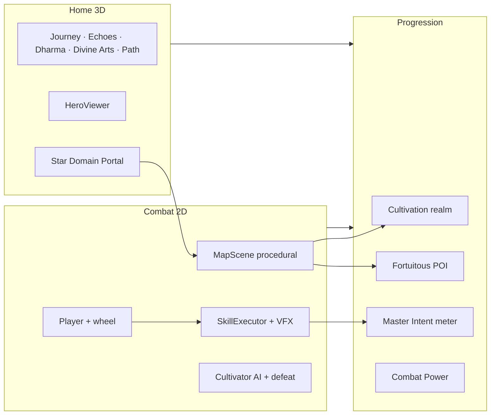

# Path of Dao — Master Track

> **Spec:** [plans/index.md](../plans/index.md)  
> **Detail notes:** [tracks/](./) (one file per sub-plan)  
> **Last updated:** 2026-07-10 (master track sync)

This is the **master progress index**. Each sub-plan has a detailed track file under `tracks/` with done/remaining items, verification notes, and Renegade Immortal alignment gaps where relevant.

---

## Progress snapshot

| Metric | Value |
|--------|-------|
| Sub-plans done | **18 / 34** (53%) |
| In progress | **15** (incl. 06 procedural fork, 14 intent redesign, 29–34 cross-cutting) |
| Pending | **0** (31 content partial — UI pending) |
| Alignment T1–T8 | **8 / 8 done** (weapon arc) |
| **Plan vs code gaps** | Master Intent (14) · Dao Scroll **UI** (31) · `divineArts` rename (30) · procedural settlements (21) |
| Active thread | **Procedural road playable** — reconcile with `map-design-canon` + ship checklist (26) |

### By phase

| Phase | Sub-plans | Status |
|-------|-----------|--------|
| **0 — Foundation** | 01–02 | `[x]` Complete |
| **1 — Core Engine** | 03–05 | `[x]` Complete |
| **2 — 2D Combat** | 06–09 | `[~]` 07–09 done; **06** procedural world landed, map canon gaps |
| **3 — 3D Home** | 10–12 | `[x]` Complete |
| **4 — Progression** | 13–16 | `[~]` 13, 15–16 done; **14** plan redesigned, code still legacy 6 intents |
| **5 — World & Content** | 17–20 | `[~]` 17 done; 18–20 in progress |
| **6 — MVP Content** | 21–23 | `[~]` Procedural maps playable; settlements/timeline/boss polish remain |
| **7 — Polish & Ship** | 24–26 | `[~]` 24–25 in progress; 26 foundation landed |
| **Cross** | 27–28 | `[x]` Echoes + Path done |
| **Cross** | 29–34 | `[~]` Integration + art/loot; **31** prose done, UI pending |

**Critical path:** `01 → 03 → 06 → 13 → 17 → 21 → 24 → 26` — through **17**; **21/31/26** active gates for ship.

---

## Status legend

| Symbol | Meaning |
|--------|---------|
| `[x]` | Done — acceptance criteria met for this sub-plan |
| `[~]` | In progress — core shipped; gaps or polish remain |
| `[ ]` | Pending — not started or blocked |

*(Renegade Immortal gap)* — sub-plan marked done but a newer plan spec diverges from code. See [Conflicts to resolve](#conflicts-to-resolve) below and [tracks/tien-nghich-alignment.md](./tien-nghich-alignment.md) (T1–T8 weapon arc).

---

## Sub-plan master table

| ID | Title | Phase | Status | Detail | Plan |
|----|-------|-------|--------|--------|------|
| 01 | Project scaffold & tooling | 0 | `[x]` | [track](./01-project-scaffold.md) | [plan](../plans/01-project-scaffold.md) |
| 02 | Scene router & app shell | 0 | `[x]` | [track](./02-scene-router-app-shell.md) | [plan](../plans/02-scene-router-app-shell.md) |
| 03 | One-thumb input & virtual joystick | 1 | `[x]` | [track](./03-input-touch-controls.md) | [plan](../plans/03-input-touch-controls.md) |
| 04 | Stat sheet & RPG core formulas | 1 | `[x]` | [track](./04-stat-sheet-rpg-core.md) | [plan](../plans/04-stat-sheet-rpg-core.md) |
| 05 | Save system foundation | 1 | `[x]` | [track](./05-save-system-foundation.md) | [plan](../plans/05-save-system-foundation.md) |
| 06 | Phaser map scene base & camera | 2 | `[~]` | [track](./06-phaser-map-scene-base.md) | [plan](../plans/06-phaser-map-scene-base.md) |
| 07 | Player controller & basic combat | 2 | `[x]` | [track](./07-player-controller-combat.md) | [plan](../plans/07-player-controller-combat.md) |
| 08 | Cultivator system & AI archetypes | 2 | `[x]` | [track](./08-enemy-system-ai.md) | [plan](../plans/08-enemy-system-ai.md) |
| 09 | Hitboxes, damage, i-frames | 2 | `[x]` | [track](./09-hitbox-damage-combat-math.md) | [plan](../plans/09-hitbox-damage-combat-math.md) |
| 10 | Three.js home scene & hero viewer | 3 | `[x]` | [track](./10-threejs-home-scene.md) | [plan](../plans/10-threejs-home-scene.md) |
| 11 | Equipment slots & 3D preview | 3 | `[x]` | [track](./11-equipment-3d-preview.md) | [plan](../plans/11-equipment-3d-preview.md) |
| 12 | Home UI panels & navigation | 3 | `[x]` | [track](./12-home-ui-panels.md) | [plan](../plans/12-home-ui-panels.md) |
| 13 | Cultivation realm & breakthrough | 4 | `[x]` | [track](./13-cultivation-realm-system.md) | [plan](../plans/13-cultivation-realm-system.md) |
| 14 | Master Intent & awakenings | 4 | `[~]` | [track](./14-insight-system.md) | [plan](../plans/14-insight-system.md) |
| 15 | Fortuitous encounter events | 4 | `[x]` | [track](./15-fortuitous-encounters.md) | [plan](../plans/15-fortuitous-encounters.md) |
| 16 | Combat power & character profile | 4 | `[x]` | [track](./16-combat-power-profile.md) | [plan](../plans/16-combat-power-profile.md) |
| 17 | World map & free travel | 5 | `[x]` | [track](./17-world-map-travel.md) | [plan](../plans/17-world-map-travel.md) |
| 18 | Chapter flow & story scenes | 5 | `[~]` | [track](./18-chapter-story-system.md) | [plan](../plans/18-chapter-story-system.md) |
| 19 | Skill executor & cultivation VFX | 5 | `[~]` | [track](./19-skill-executor-vfx.md) | [plan](../plans/19-skill-executor-vfx.md) |
| 20 | Content pipeline & validators | 5 | `[~]` | [track](./20-content-pipeline.md) | [plan](../plans/20-content-pipeline.md) |
| 21 | MVP maps: chapters 1–5 | 6 | `[~]` | [track](./21-mvp-maps-chapters-1-5.md) | [plan](../plans/21-mvp-maps-chapters-1-5.md) |
| 22 | MVP maps: chapters 6–10 | 6 | `[~]` | [track](./22-mvp-maps-chapters-6-10.md) | [plan](../plans/22-mvp-maps-chapters-6-10.md) |
| 23 | MVP enemies, bosses, skill data | 6 | `[~]` | [track](./23-mvp-enemies-bosses-skills.md) | [plan](../plans/23-mvp-enemies-bosses-skills.md) |
| 24 | Localization en + vi | 7 | `[~]` | [track](./24-localization-en-vi.md) | [plan](../plans/24-localization-en-vi.md) |
| 25 | Audio, aura VFX, juice | 7 | `[~]` | [track](./25-audio-vfx-polish.md) | [plan](../plans/25-audio-vfx-polish.md) |
| 26 | PWA, performance, ship checklist | 7 | `[~]` | [track](./26-pwa-performance-ship.md) | [plan](../plans/26-pwa-performance-ship.md) |
| 27 | Echoes of the Ancients (guided demo) | Cross | `[x]` | [track](./27-ancient-echo-demo.md) | [plan](../plans/27-ancient-echo-demo.md) |
| 28 | Path & Journey (My Path + follow ancients) | Cross | `[x]` | [track](./28-path-journey-system.md) | [plan](../plans/28-path-journey-system.md) |
| 29 | Combat visual integration (Fake 2.5D) | Cross | `[~]` | [track](./29-pixel-art-combat-canon.md) | [plan](../plans/29-pixel-art-combat-canon.md) |
| 30 | Divine Arts 6-slot wheel loadout | Cross | `[~]` | [track](./30-divine-arts-wheel-loadout.md) | [plan](../plans/30-divine-arts-wheel-loadout.md) |
| 31 | Wang Lin timeline (Dao Scroll) | Cross | `[~]` | [track](./31-wang-lin-story-timeline.md) | [plan](../plans/31-wang-lin-story-timeline.md) |
| 32 | Design Arts (sprites, icons) | Cross | `[~]` | [track](./32-design-arts.md) | [plan](../plans/design-arts/index.md) |
| 33 | Item & loot system | Cross | `[~]` | [track](./33-item-loot-system.md) | [plan](../plans/item-system/index.md) |
| 34 | Quick check (smoke + DevTools) | Cross | `[~]` | [track](./34-quick-check-smoke-devtools.md) | [plan](../plans/34-quick-check-smoke-devtools.md) |

**Canon docs (no separate track):** [map-design-canon](../plans/map-design-canon.md) · [combat-defeat-canon](../plans/combat-defeat-canon.md) · [fake-2.5d](../plans/fake-2.5d.md) · [vfx-juice-tiers](../plans/vfx-juice-tiers.md)

---

## Renegade Immortal alignment (T1–T8)

**Detail:** [tracks/tien-nghich-alignment.md](./tien-nghich-alignment.md) *(filename legacy; content = Renegade Immortal)*  
**Story reference:** [handbook/renegade-immortal-reference.md](../handbook/renegade-immortal-reference.md) · skill `renegade-immortal`  
**Spec:** [plans/index.md §1.1, §7.7, §7.8](../plans/index.md)

| # | Requirement | Status | Owner tracks |
|---|-------------|--------|--------------|
| T1 | New game **unarmed** — hand/kick 3-hit combo, no sword equipped | `[x]` | 07, 11 |
| T2 | **Ancient Spirit Sword** from shrine POI in chapters 1–2 | `[x]` | 15, 21 |
| T3 | Equipping ancient sword **swaps** combo to sword + unlocks Sword Intent | `[x]` | 07, 14, 23 |
| T4 | Remove **starter wood sword** from default new game loadout | `[x]` | 05, 11 |
| T5 | **Map-by-map road** — world map labels + Phong Giới cosmic barrier | `[x]` | 17, 21, 22 |
| T6 | **Chapter stories** — Wang Lin diary tone, all 10 chapters × 6 slides en+vi | `[x]` | 18, 24, 31 (prose) |
| T7 | **Sword Intent gating** in skill picker and combat | `[x]` | 19, 23 |
| T8 | **3D Home** shows empty hands until sword milestone | `[x]` | 10, 11 |

---

## Conflicts to resolve (plans vs shipped code)

**User decisions (2026-07-10):** C1 → keep procedural · C2 → migrate Master Intent · C3 → rename `divineArts` only

| # | Topic | Resolution | Track action |
|---|--------|------------|--------------|
| C1 | **Map runtime** | **Keep procedural endless** — add settlements/signature trees as procedural props; relax Tiled 16k as hard gate | 21/22/06 remaining updated |
| C2 | **Master Intent** | **Migrate** plan 14 redesign (`MasterIntentSystem`, main-flow + gate) | 14 back to active work |
| C3 | **Wheel save** | **Rename** `equippedSkills` → `divineArts` in save/UI; keep indexed shape + `''` empty for now | 30 remaining |
| C4 | **Dao Scroll** | **Locale prose done** — runtime B→C→D pending (plan 31 §9.1) | 31 `[~]` |
| C5 | **Defeat canon** | Simplified defeat-in-place OK for MVP; full origin tween optional later | 06 note |
| C6 | **Ch1 star zones** | Keep star sub-zones (east/south/north) — no revert | 21 done note |

---

## MVP definition of done

From [plans/index.md §12](../plans/index.md). Checked items reflect current build state.

- [x] Echoes of the Ancients — six focused demo walks; combat-first god-mode (sub-plan 27)
- [x] Path & Journey — My Path scroll + guided ancient walk (sub-plan 28)
- [x] Player can: boot → Home → pick map → combat → clear/fail → save → return Home
- [x] **New game starts unarmed** — punch/kick combo (`hero_strike_*`); no sword in weapon slot (T1, T4)
- [x] **Ancient Spirit Sword** obtainable from map POI (ch1–2); equipping enables sword combo + Sword Intent (T2, T3)
- [~] All 10 chapters playable with **6-slide** Wang Lin diary scenes (18 content done; illustrations pending)
- [~] 20 maps traversable — procedural endless playable; settlements/trees as procedural props pending
- [~] 8 boss fights with distinct patterns (23 — phase tracker wired; pattern polish open)
- [~] 40 Divine Arts equippable; Sword Intent gated until ancient sword (T7 done)
- [~] **Master Intent** — legacy meter works; plan 14 redesign not migrated
- [~] **Dao Scroll** — **20-map prose in `timeline.json`**; shard JSON + Path sub-tab + unlock flow pending (31)
- [ ] **Fake 2.5D ship gate** — authored sprites replace sticky-man (plans 29 + 32)
- [ ] Full UI in English and Vietnamese (24)
- [ ] PWA installable; 30 FPS on mid-range Android (26)
- [~] No console errors in 10-minute playthrough — **22 unit tests failing** at 2026-07-10 (fix before ship)
- [~] Quick check — `pnpm smoke:test` exists; wire into every batch sign-off (plan 34)

---

## Active thread

**Base flow `[x]`** — boot → Home → map → combat → save → return (E2E signed off 2026-07-03)

| Automated E2E | Coverage |
|---------------|----------|
| Fresh-save full road ch1–10 | Begin Journey → all maps/stories/skills → journey complete |
| Echoes Follow / Walk Here / sword ancestor path | Guided demo + god-mode |
| World map portal + lock | Free jump + chapter gate UI |
| Save reload + settings | Continue Journey, fullscreen, version |

- **~500 unit tests passing** · **37 E2E** · **22 unit failures** to triage (2026-07-10)
- **New since last track sync:** procedural world profiles, 2.5D tiles, skill VFX tiers, plans 29–34

**Next priorities:** plan **31** Dao Scroll **runtime** (B→D) → **14** Master Intent → `divineArts` rename → ship **26**

---

## How systems work together (plans snapshot)

| Layer | Plans | Track status |
|-------|-------|--------------|
| **Controls** | Wheel + Dash + Gather Qi (§1.2) | `[x]` 03, 07 |
| **Divine Arts** | Cast pipeline + 6 slots (19, 30) | `[~]` VFX strong; save rename open |
| **Master Intent** | Emergent awakenings (14) | `[~]` legacy 6 intents shipped |
| **Level design** | 20 maps + settlements + trees | `[~]` procedural fork (C1) |
| **Story** | Chapter finales (18) prose `[x]` · Dao Scroll UI (31) `[ ]` | `[~]` |
| **Art** | design-arts (32) → combat hooks (29) | `[~]` placeholders |
| **Loot** | item-system (33) | `[~]` drops work |
| **Ship** | 24–26 + quick check (34) | `[~]` |

---

## Detail tracks — in progress

### 14 — Master Intent `[~]`

| Done | Remaining |
|------|-----------|
| Legacy 6-intent XP meter + awakening ceremony | Plan redesign: main-flow + gate intents |
| Sword gate until ancient sword (T7) | `MasterIntentSystem` + `insights.json` migration |

→ [full track](./14-insight-system.md)

### 15 — Fortuitous encounters `[x]`

| Done | Remaining |
|------|-----------|
| Six encounter types, roll tables, POI triggers | — |
| Modal pause flow, rewards; ancient sword milestone | — |
| My Path journey + fortune toast on claim | — |
| Shutdown-race guard in `EncounterTrigger.presentEncounter` | — |

→ [full track](./15-fortuitous-encounters.md)

### 18 — Chapter & story system `[~]`

| Done | Remaining |
|------|-----------|
| StoryReader + 10 chapter finales; **6 slides/ch** Wang Lin prose en+vi | Chapter illustrations; Dao Scroll hook on map clear (31) |

→ [full track](./18-chapter-story-system.md) — **What needs to do** table

### 31 — Dao Scroll `[~]`

| Done | Remaining |
|------|-----------|
| 20-map locale prose (`timeline.json` en+vi) | Shard JSON, save, Path sub-tab, unlock modal — phases B–E |

→ [full track](./31-wang-lin-story-timeline.md) — **What needs to do** checklist

### 19 — Skill executor & VFX `[~]`

| Done | Remaining |
|------|-----------|
| Cast pipeline, tier VFX, thunder chain, intent textures | Audio sync; sprite-sheet art pass (32) |
| Sword Intent gating in combat (T7) | |

→ [full track](./19-skill-executor-vfx.md)

### 20 — Content pipeline `[~]`

| Done | Remaining |
|------|-----------|
| Zod validate-all, cross-ref lint, content loader | Expand lint as MVP content grows |
| Pack command, ID/CP/Tiled docs | Optional CI gate on `content:validate` |
| 249+ unit tests green at last run | |

→ [full track](./20-content-pipeline.md)

### 21 — MVP maps ch1–5 `[~]`

| Done | Remaining |
|------|-----------|
| 10 maps + procedural endless + 2.5D biomes | 16k bounds + settlements + signature trees |
| Ancient sword POI; ch1 star sub-zones | Dao Scroll shards (plan 31) |
| POI + roam + world profiles | CP playtest balance |

→ [full track](./21-mvp-maps-chapters-1-5.md)

### 22 — MVP maps ch6–10 `[~]`

| Done | Remaining |
|------|-----------|
| 10 endgame maps, five visual themes | Arc copy/tone for tribulation → void (T5) |
| Void Throne 56×42 finale; CP ~45k–320k | Boss pattern and phase tuning |
| 19 enemies; hidden caves ch6, 8, 10 | Playthrough balance on CP bands |

→ [full track](./22-mvp-maps-chapters-6-10.md)

### 23 — Enemies, bosses, skills `[~]`

| Done | Remaining |
|------|-----------|
| 40 skills, 41 enemies, loot, unlock hooks | Distinct patterns for all 8 MVP bosses |
| Sword Intent gate (T7) | Awakening VFX art pass (29+32) |

→ [full track](./23-mvp-enemies-bosses-skills.md)

### 24 — Localization en + vi `[~]`

| Done | Remaining |
|------|-----------|
| Locale manager, parity lint, glossary, Noto Sans | Full UI audit in both locales |
| System/home/world/story/skills/enemies/bestiary files | Dao Scroll tab strings when UI ships (31) |
| 41 bestiary entries; settings language picker | Vietnamese layout overflow pass |
| 300+ unit tests green at last run | |

→ [full track](./24-localization-en-vi.md)

### 25 — Audio & VFX polish `[~]`

| Done | Remaining |
|------|-----------|
| Web Audio buses; **26 procedural SFX**, **6 BGM** with mood profiles | Replace with real OGG assets |
| Preset synthesis (impacts, skills, stings, loot); crit + duck mix | File playback in AudioManager |
| First-visit unlock overlay; silent resume on return | Boss telegraph SFX (no event yet) |
| BGM crossfade; per-map BGM (Fallen Village melancholy); **home/story calm sine pad** (startup buzz fix) | Low-end juice disable profile (26) |
| Hit-stop, camera shake, crit flash | Boss phase screen darken (visual) |
| `ui.panel_open` + `loot.pickup` wired; UI bus tier | Dedicated UI volume slider |
| Home aura pulse Core Formation+ | `player.land` (no jump mechanic) |

→ [full track](./25-audio-vfx-polish.md)

### 26 — PWA & ship `[~]`

| Done | Remaining |
|------|-----------|
| QualityProfile; low tier disables juice + aura particles | Real app icons |
| vite-plugin-pwa, manifest, SW; CI unit + e2e jobs | Lighthouse PWA audit |
| E2E smoke: home → ch1 combat → home → vi locale | Manual SHIP_CHECKLIST sign-off |
| `handbook/SHIP_CHECKLIST.md`; version in settings | 30 FPS throttled Android verification |

→ [full track](./26-pwa-performance-ship.md)

### 28 — Path & Journey `[x]`

| Done |
|------|
| My Path scroll, journey recording, ancient `path[]` data |
| PathWalkManager guided walk (map → story → map → Home) |
| Modal **Their Road** + Follow / Walk Here; en/vi strings |

→ [full track](./28-path-journey-system.md)

### 29–34 — Cross-cutting `[~]` / `[ ]`

| ID | Status | Highlight |
|----|--------|-----------|
| 29 | `[~]` | Sticky-man + camera + VFX integration; DA sprites pending |
| 30 | `[~]` | 6-slot wheel works; `divineArts` rename open |
| 31 | `[~]` | **Dao Scroll prose done**; phases B–E in track 31 |
| 32 | `[~]` | design-arts tree; encounter art only |
| 33 | `[~]` | Drops + equip baseline |
| 34 | `[~]` | smoke:test; fix unit failures |
| 34 | `[~]` | smoke:test; 22 unit failures |

→ detail tracks in [tracks/](./)

---

## Detail tracks — done (reference)

Sub-plans **01–05**, **07–13**, **15–17**, **27–28** meet their **original** acceptance criteria. See [Conflicts to resolve](#conflicts-to-resolve) for newer plan deltas (14, 06, 21).

| ID | Highlight |
|----|-----------|
| 01–05 | Scaffold, router, input, stats, save |
| 07 | Unarmed → sword combo, Gather Qi, dash i-frames (T1, T3) |
| 08–09 | Cultivator AI, hitboxes & damage |
| 10–12 | Three.js Home, equipment, UI panels (T8 empty hands) |
| 13 | Realm breakthrough |
| 15–17 | Encounters, CP profile, world map (T2, T5) |
| 27 | Ancient Echo demo |
| 28 | Path & Journey |

→ Per-sub-plan notes in [tracks/](./)

---

## Parallel work guide

| After completing | Can start in parallel |
|------------------|----------------------|
| 05 | 06 (combat) + 10 (home) — **both done** |
| 09 | 13, 14, 15 — **13–16 done; 15 in progress** |
| 12 + 09 | 17, 18, 19 — **17 done; 18–19 in progress** |
| 13–15 | 27 — **done** |
| 20 | 21, 22, 23 — **all in progress** |
| 25 | 26 — **next** |

---

## How to update this file

1. Implement work against a sub-plan in `plans/`.
2. Update the matching detail file in `tracks/` (done / remaining / verification).
3. Refresh status symbols and this master table when a sub-plan crosses done or picks up new gaps.
4. For Renegade Immortal weapon arc (T1–T8), update [tracks/tien-nghich-alignment.md](./tien-nghich-alignment.md).
