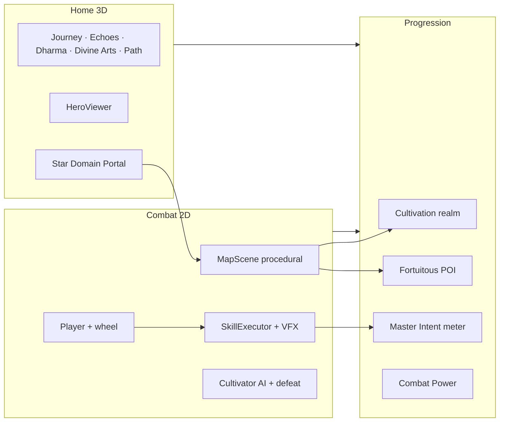

# Path of Dao — Master Track

> **This file is the sole progress record** — what is done, in progress, and what needs to do.  
> **Specs (what to build):** [plans/index.md](../plans/index.md)  
> **Detail notes:** [tracks/](./) — one `tracks/NN-slug.md` per sub-plan  
> **Last updated:** 2026-07-11

Each sub-plan track has **Done** · **Remaining** · **What needs to do** (where applicable) · **Verification**.

---

## Progress snapshot

| Metric | Value |
|--------|-------|
| Sub-plans done | **19 / 34** (56%) |
| In progress | **14** (incl. 06 procedural fork, 29–34 cross-cutting) |
| Pending | **0** (31 content partial — UI pending) |
| Alignment T1–T8 | **8 / 8 done** (weapon arc) |
| **Plan vs code gaps** | Dao Scroll **illustrations** (31 Phase E1 — tooltip/auto-walk code hooks done 2026-07-10) · `divineArts` rename (30) |
| Active thread | **Procedural road playable** — reconcile with `map-design-canon` + ship checklist (26) |

### By phase

| Phase | Sub-plans | Status |
|-------|-----------|--------|
| **0 — Foundation** | 01–02 | `[x]` Complete |
| **1 — Core Engine** | 03–05 | `[x]` Complete |
| **2 — 2D Combat** | 06–09 | `[~]` 07–09 done; **06** procedural world landed, map canon gaps |
| **3 — 3D Home** | 10–12 | `[x]` Complete |
| **4 — Progression** | 13–16 | `[x]` 13–16 done — **14** Master Intent migration shipped 2026-07-10 |
| **5 — World & Content** | 17–20 | `[~]` 17 done; 18–20 in progress |
| **6 — MVP Content** | 21–23 | `[~]` Procedural maps playable with settlements/signature trees; **23** boss distinct patterns landed 2026-07-10, timeline polish remains |
| **7 — Polish & Ship** | 24–26 | `[~]` 24–25 in progress; 26 foundation landed |
| **Cross** | 27–28 | `[x]` Echoes + Path done |
| **Cross** | 29–34 | `[~]` Integration + art/loot; **31** prose done, UI pending |

**Critical path:** `01 → 03 → 06 → 13 → 17 → 21 → 24 → 26` — through **17**; **21/31/26** active gates for ship.

---

## Status legend

| Symbol | Meaning |
|--------|---------|
| `[x]` | Done — acceptance criteria met for this sub-plan |
| `[~]` | In progress — core shipped; gaps or polish remain |
| `[ ]` | Pending — not started or blocked |

*(Renegade Immortal gap)* — sub-plan marked done but a newer plan spec diverges from code. See [Conflicts to resolve](#conflicts-to-resolve) below and [tracks/tien-nghich-alignment.md](./tien-nghich-alignment.md) (T1–T8 weapon arc).

---

## Sub-plan master table

| ID | Title | Phase | Status | Detail | Plan |
|----|-------|-------|--------|--------|------|
| 01 | Project scaffold & tooling | 0 | `[x]` | [track](./01-project-scaffold.md) | [plan](../plans/01-project-scaffold.md) |
| 02 | Scene router & app shell | 0 | `[x]` | [track](./02-scene-router-app-shell.md) | [plan](../plans/02-scene-router-app-shell.md) |
| 03 | One-thumb input & virtual joystick | 1 | `[x]` | [track](./03-input-touch-controls.md) | [plan](../plans/03-input-touch-controls.md) |
| 04 | Stat sheet & RPG core formulas | 1 | `[x]` | [track](./04-stat-sheet-rpg-core.md) | [plan](../plans/04-stat-sheet-rpg-core.md) |
| 05 | Save system foundation | 1 | `[x]` | [track](./05-save-system-foundation.md) | [plan](../plans/05-save-system-foundation.md) |
| 06 | Phaser map scene base & camera | 2 | `[~]` | [track](./06-phaser-map-scene-base.md) | [plan](../plans/06-phaser-map-scene-base.md) |
| 07 | Player controller & basic combat | 2 | `[x]` | [track](./07-player-controller-combat.md) | [plan](../plans/07-player-controller-combat.md) |
| 08 | Cultivator system & AI archetypes | 2 | `[x]` | [track](./08-enemy-system-ai.md) | [plan](../plans/08-enemy-system-ai.md) |
| 09 | Hitboxes, damage, i-frames | 2 | `[x]` | [track](./09-hitbox-damage-combat-math.md) | [plan](../plans/09-hitbox-damage-combat-math.md) |
| 10 | Three.js home scene & hero viewer | 3 | `[x]` | [track](./10-threejs-home-scene.md) | [plan](../plans/10-threejs-home-scene.md) |
| 11 | Equipment slots & 3D preview | 3 | `[x]` | [track](./11-equipment-3d-preview.md) | [plan](../plans/11-equipment-3d-preview.md) |
| 12 | Home UI panels & navigation | 3 | `[x]` | [track](./12-home-ui-panels.md) | [plan](../plans/12-home-ui-panels.md) |
| 13 | Cultivation realm & breakthrough | 4 | `[x]` | [track](./13-cultivation-realm-system.md) | [plan](../plans/13-cultivation-realm-system.md) |
| 14 | Master Intent & awakenings | 4 | `[x]` | [track](./14-insight-system.md) | [plan](../plans/14-insight-system.md) |
| 15 | Fortuitous encounter events | 4 | `[x]` | [track](./15-fortuitous-encounters.md) | [plan](../plans/15-fortuitous-encounters.md) |
| 16 | Combat power & character profile | 4 | `[x]` | [track](./16-combat-power-profile.md) | [plan](../plans/16-combat-power-profile.md) |
| 17 | World map & free travel | 5 | `[x]` | [track](./17-world-map-travel.md) | [plan](../plans/17-world-map-travel.md) |
| 18 | Chapter flow & story scenes | 5 | `[~]` | [track](./18-chapter-story-system.md) | [plan](../plans/18-chapter-story-system.md) |
| 19 | Skill executor & cultivation VFX | 5 | `[~]` | [track](./19-skill-executor-vfx.md) | [plan](../plans/19-skill-executor-vfx.md) |
| 20 | Content pipeline & validators | 5 | `[~]` | [track](./20-content-pipeline.md) | [plan](../plans/20-content-pipeline.md) |
| 21 | MVP maps: chapters 1–5 | 6 | `[~]` | [track](./21-mvp-maps-chapters-1-5.md) | [plan](../plans/21-mvp-maps-chapters-1-5.md) |
| 22 | MVP maps: chapters 6–10 | 6 | `[~]` | [track](./22-mvp-maps-chapters-6-10.md) | [plan](../plans/22-mvp-maps-chapters-6-10.md) |
| 23 | MVP enemies, bosses, skill data | 6 | `[~]` | [track](./23-mvp-enemies-bosses-skills.md) | [plan](../plans/23-mvp-enemies-bosses-skills.md) |
| 24 | Localization en + vi | 7 | `[~]` | [track](./24-localization-en-vi.md) | [plan](../plans/24-localization-en-vi.md) |
| 25 | Audio, aura VFX, juice | 7 | `[~]` | [track](./25-audio-vfx-polish.md) | [plan](../plans/25-audio-vfx-polish.md) |
| 26 | PWA, performance, ship checklist | 7 | `[~]` | [track](./26-pwa-performance-ship.md) | [plan](../plans/26-pwa-performance-ship.md) |
| 27 | Echoes of the Ancients (guided demo) | Cross | `[x]` | [track](./27-ancient-echo-demo.md) | [plan](../plans/27-ancient-echo-demo.md) |
| 28 | Path & Journey (My Path + follow ancients) | Cross | `[x]` | [track](./28-path-journey-system.md) | [plan](../plans/28-path-journey-system.md) |
| 29 | Combat visual integration (Fake 2.5D) | Cross | `[~]` | [track](./29-pixel-art-combat-canon.md) | [plan](../plans/29-pixel-art-combat-canon.md) |
| 30 | Divine Arts 6-slot wheel loadout | Cross | `[~]` | [track](./30-divine-arts-wheel-loadout.md) | [plan](../plans/30-divine-arts-wheel-loadout.md) |
| 31 | Wang Lin timeline (Dao Scroll) | Cross | `[~]` | [track](./31-wang-lin-story-timeline.md) | [plan](../plans/31-wang-lin-story-timeline.md) |
| 32 | Design Arts (sprites, icons) | Cross | `[~]` | [track](./32-design-arts.md) | [plan](../plans/design-arts/index.md) |
| 33 | Item & loot system | Cross | `[~]` | [track](./33-item-loot-system.md) | [plan](../plans/item-system/index.md) |
| 34 | Quick check (smoke + DevTools) | Cross | `[~]` | [track](./34-quick-check-smoke-devtools.md) | [plan](../plans/34-quick-check-smoke-devtools.md) |

**Canon docs (no separate track):** [map-design-canon](../plans/map-design-canon.md) · [combat-defeat-canon](../plans/combat-defeat-canon.md) · [fake-2.5d](../plans/fake-2.5d.md) · [vfx-juice-tiers](../plans/vfx-juice-tiers.md)

---

## Renegade Immortal alignment (T1–T8)

**Detail:** [tracks/tien-nghich-alignment.md](./tien-nghich-alignment.md) *(filename legacy; content = Renegade Immortal)*  
**Story reference:** [handbook/renegade-immortal-reference.md](../handbook/renegade-immortal-reference.md) · skill `renegade-immortal`  
**Spec:** [plans/index.md §1.1, §7.7, §7.8](../plans/index.md)

| # | Requirement | Status | Owner tracks |
|---|-------------|--------|--------------|
| T1 | New game **unarmed** — hand/kick 3-hit combo, no sword equipped | `[x]` | 07, 11 |
| T2 | **Ancient Spirit Sword** from shrine POI in chapters 1–2 | `[x]` | 15, 21 |
| T3 | Equipping ancient sword **swaps** combo to sword + unlocks Sword Intent | `[x]` | 07, 14, 23 |
| T4 | Remove **starter wood sword** from default new game loadout | `[x]` | 05, 11 |
| T5 | **Map-by-map road** — world map labels + Phong Giới cosmic barrier | `[x]` | 17, 21, 22 |
| T6 | **Chapter stories** — Wang Lin diary tone, all 10 chapters × 6 slides en+vi | `[x]` | 18, 24, 31 (prose) |
| T7 | **Sword Intent gating** in skill picker and combat | `[x]` | 19, 23 |
| T8 | **3D Home** shows empty hands until sword milestone | `[x]` | 10, 11 |

---

## Conflicts to resolve (plans vs shipped code)

**User decisions (2026-07-10):** C1 → keep procedural · C2 → migrate Master Intent · C3 → rename `divineArts` only

| # | Topic | Resolution | Track action |
|---|--------|------------|--------------|
| C1 | **Map runtime** | **Keep procedural endless** — add settlements/signature trees as procedural props; relax Tiled 16k as hard gate | 21/22/06 remaining updated |
| C2 | **Master Intent** | **Migrated** plan 14 redesign (`MasterIntentSystem`, main-flow + gate) — `[x]` done 2026-07-10 | 14 done |
| C3 | **Wheel save** | **Renamed** `equippedSkills` → `divineArts` in save/UI (`[x]` done 2026-07-10) — kept indexed shape + `''` empty as decided | 30 remaining (pause editor, DA-04 icons) |
| C4 | **Dao Scroll** | **Phases B→D shipped 2026-07-10** — shard JSON, save unlock, Path sub-tab all playable; **Phase E2/E3 code hooks shipped 2026-07-10** (world map tooltip, ancient auto-walk); only E1 illustrations remain | 31 `[~]` |
| C5 | **Defeat canon** | Simplified defeat-in-place OK for MVP; full origin tween optional later | 06 note |
| C6 | **Ch1 star zones** | Keep star sub-zones (east/south/north) — no revert | 21 done note |

---

## MVP definition of done

From [plans/index.md §12](../plans/index.md). Checked items reflect current build state.

- [x] Echoes of the Ancients — six focused demo walks; combat-first god-mode (sub-plan 27)
- [x] Path & Journey — My Path scroll + guided ancient walk (sub-plan 28)
- [x] Player can: boot → Home → pick map → combat → clear/fail → save → return Home
- [x] **New game starts unarmed** — punch/kick combo (`hero_strike_*`); no sword in weapon slot (T1, T4)
- [x] **Ancient Spirit Sword** obtainable from map POI (ch1–2); equipping enables sword combo + Sword Intent (T2, T3)
- [~] All 10 chapters playable with **6-slide** Wang Lin diary scenes (18 content done; illustrations pending)
- [x] 20 maps traversable — procedural endless playable; settlement clusters + signature tree spawn per `worldProfile`
- [~] 8 boss fights with distinct patterns (23 — phase tracker wired; pattern polish open)
- [~] 40 Divine Arts equippable; Sword Intent gated until ancient sword (T7 done)
- [x] **Master Intent** — plan 14 redesign migrated: main-flow (`life_death`→`cause_effect`→`truth_falsehood`) + gate-flow (`sword`/`flame`/`lightning`)
- [~] **Dao Scroll** — 20 shards playable (offer modal → read → Path tab **Dao Scroll** sub-tab, replay-safe); world map tooltip + ancient auto-walk shipped 2026-07-10; illustrations still pending (31 Phase E1)
- [ ] **Fake 2.5D ship gate** — authored sprites replace sticky-man (plans 29 + 32)
- [ ] Full UI in English and Vietnamese (24)
- [ ] PWA installable; 30 FPS on mid-range Android (26)
- [~] No console errors in 10-minute playthrough — **22 unit tests failing** at 2026-07-10 (fix before ship)
- [~] Quick check — `pnpm smoke:test` exists; wire into every batch sign-off (plan 34)

---

## Active thread

**Base flow `[x]`** — boot → Home → map → combat → save → return (E2E signed off 2026-07-03)

| Automated E2E | Coverage |
|---------------|----------|
| Fresh-save full road ch1–10 | Begin Journey → all maps/stories/skills → journey complete |
| Echoes Follow / Walk Here / sword ancestor path | Guided demo + god-mode |
| World map portal + lock | Free jump + chapter gate UI |
| Save reload + settings | Continue Journey, fullscreen, version |

- **599 unit tests passing, 0 failing** (2026-07-10 — +5 loot→item cross-ref lint + boss loot audit tests, track 33/20; +51 earlier from Dao Scroll Phase E2/E3 code hooks: `path-walk.test.ts` (+4), new `region-node.test.ts` (3), plus earlier Master Intent migration tests; see track 14 and 31) · **37 E2E**
- **New since last track sync:** Dao Scroll Phase E2/E3 (31), Master Intent migration (14), procedural world profiles, 2.5D tiles, skill VFX tiers, plans 29–34; **procedural cultivator power halved** (`PROCEDURAL_BASE_POWER = 0.5`, tracks 06/21); **beast creature silhouettes** (blob/quadruped/arachnid/avian/spectral/drake — tracks 08/29)

**Next priorities:** plan **31** Dao Scroll **Phase E1** (illustrations only — code hooks done) → ship **26** (`divineArts` rename done 2026-07-10, track 30)

---

## What needs to do (master backlog)

Ordered by dependency and your 2026-07-10 decisions. Detail checklists live in each sub-plan track.

### P0 — Ship blockers

| # | Task | Track | Notes |
|---|------|-------|-------|
| 1 | ~~Fix **22 failing unit tests**~~ | 34 | `[x]` Done 2026-07-10 — all were stale expectations, no code bugs found |
| 2 | ~~**Dao Scroll runtime** — phases B→D (shard JSON, save unlock, Path sub-tab)~~ | 31 | `[x]` Done 2026-07-10 — 20 shards playable, offer modal, Dao Scroll sub-tab, replay-safe |
| 3 | ~~**Master Intent migration** — `MasterIntentSystem`, new `insights.json`~~ | 14 | `[x]` Done 2026-07-10 — main-flow + gate-flow, save migration, Dao Scroll `intentLesson` ids |
| 4 | Manual **SHIP_CHECKLIST** + Lighthouse + 30 FPS device | 26 | After tests green |

### P1 — MVP completeness

| # | Task | Track | Notes |
|---|------|-------|-------|
| 5 | ~~Rename `equippedSkills` → `divineArts` (save + UI; keep `[0..5]`)~~ | 30 | `[x]` Done 2026-07-10 — schema, types, all consumers, `ancients.json`, tests; v1 load alias in `SaveMigration.ts` |
| 6 | ~~**10 boss distinct patterns** — telegraphs, phases, punish windows~~ | 23 | `[x]` Done 2026-07-10 — `combat:boss-phase-changed` event (juice shake + audio on real phase shifts, not just defeat); per-phase `telegraphMs`/`strikeMs`/`telegraphColor`; content `attackShape` (circle/aoe_ring/projectile) drives `SpawnManager.resolveStrike`; all 10 bosses tuned distinct (shape/range/cooldown/adds). Unique move scripts + enrage timer still open as polish |
| 7 | ~~Procedural **settlement clusters + signature tree** per `worldProfile`~~ | 06, 21, 22 | `[x]` Done 2026-07-10 — `ProceduralSettlementGenerator` + `SettlementDecorator`; auto-defaults + authored fallen_village pair |
| 8 | ~~Map-clear modal → offer timeline shard read~~ | 18, 31 | `[x]` Done 2026-07-10 — `TimelineOfferModal` in `MapScene.finishMapExit` |
| 9 | ~~`opponentKind: beast\|cultivator` on enemies + recovery rules~~ | 06, 08 | `[x]` Done 2026-07-10 — beasts despawn; cultivators sit gather-qi; bosses sit stay-down (no pool release — fixed same day) |
| 10 | ~~Full **en/vi UI audit** + Vietnamese overflow~~ | 24 | `[x]` Done 2026-07-10 — `i18n:lint --strict` was failing on 38 missing vi keys (Dharma/Divine/Intent rename labels), now 0 errors; 3 hardcoded aria-label strings fixed in `src/ui` (nav, dharma close, skill picker); `:lang(vi)` CSS + smaller font added for the two riskiest multi-tab bars (Profile sub-tabs, Path sub-tabs). On-device visual QA still open |

### P2 — Polish & art (parallel)

| # | Task | Track | Notes |
|---|------|-------|-------|
| 11 | **DA-01 hero** sprites → replace sticky-man | 32, 29 | Ship gate plan 29 §0 |
| 12 | DA-02/03 enemies + bosses; DA-04 wheel icons | 32, 29, 30 | |
| 13 | Chapter + timeline **illustrations** (webp or null) | 32, 18, 31 | Polish, not logic block |
| 14 | ~~Skill cast **audio sync** on impact frames~~ | 19, 25 | `[x]` Done 2026-07-10 — `castFrameMs`/`impactFrameMs` schema fields; `SkillExecutor` schedules `skill:cast`/`skill:impact` via scene timer (kind default: melee `impactFrameMs` 140ms); boss telegraph SFX verified already wired (`combat:boss-phase-changed` → `boss.telegraph`) |
| 15 | Real **OGG** assets + file playback | 25 | Procedural OK for MVP if time short |
| 16 | ~~Validator: `timelineShardId` on all maps; CI `content:validate`~~ | 20, 31 | `[x]` Done 2026-07-10 — `lintCrossrefs` + schema validate all 20 shards |
| 17 | ~~Loot→item cross-ref lint + boss loot audit~~; full item roster + pity still open | 33, 20 | `[x]` lint+audit done 2026-07-10 — 10/10 bosses had valid loot tables, no broken refs found; pity (IS-04) skipped as underspecified (see track 33 note); full item roster pass remains |

### Done — do not rework unless plan changes

`01–05`, `07–13`, `15–17`, `27–28`, weapon arc **T1–T8**, base E2E flow, fortuitous encounters, procedural maps playable, 40 skills data, chapter story prose (6 slides × 10 ch).

---

## How systems work together (plans snapshot)

| Layer | Plans | Track status |
|-------|-------|--------------|
| **Controls** | Wheel + Dash + Gather Qi (§1.2) | `[x]` 03, 07 |
| **Divine Arts** | Cast pipeline + 6 slots (19, 30) | `[~]` VFX + audio sync strong; save rename open |
| **Master Intent** | Emergent awakenings (14) | `[x]` main-flow + gate-flow migrated |
| **Level design** | 20 maps + settlements + trees | `[x]` procedural fork (C1) — auto + authored |
| **Story** | Chapter finales (18) prose `[x]` · Dao Scroll runtime B→D (31) `[x]` · Phase E2/E3 code hooks `[x]` · Phase E1 art `[ ]` | `[~]` |
| **Art** | design-arts (32) → combat hooks (29) | `[~]` placeholders |
| **Loot** | item-system (33) | `[~]` drops work |
| **Ship** | 24–26 + quick check (34) | `[~]` |

---

## Detail tracks — in progress

### 06 — Map scene & procedural world `[~]`

| Done | Remaining |
|------|-----------|
| Tiled/roam + procedural endless + camera + pause exit | Settlement clusters + signature tree props |
| `CombatCameraDirector` (attack punch + meditate close-up), per-map ground palettes, `opponentKind` beast vs cultivator | — |

→ [full track](./06-phaser-map-scene-base.md) — **What needs to do** table

### 15 — Fortuitous encounters `[x]`

| Done | Remaining |
|------|-----------|
| Six encounter types, roll tables, POI triggers | — |
| Modal pause flow, rewards; ancient sword milestone | — |
| My Path journey + fortune toast on claim | — |
| Shutdown-race guard in `EncounterTrigger.presentEncounter` | — |

→ [full track](./15-fortuitous-encounters.md)

### 18 — Chapter & story system `[~]`

| Done | Remaining |
|------|-----------|
| StoryReader + 10 chapter finales; **6 slides/ch** Wang Lin prose en+vi | Chapter illustrations |
| Dao Scroll hook on map clear (31) — `[x]` done 2026-07-10 | |

→ [full track](./18-chapter-story-system.md) — **What needs to do** table

### 31 — Dao Scroll `[~]`

| Done | Remaining |
|------|-----------|
| 20-map locale prose (`timeline.json` en+vi) | Illustrations (`assets/story/timeline/*.webp`) — Phase E1 only |
| **Phases B→D shipped 2026-07-10** — shard JSON + `TimelineLoader`, `timelineSeen` save + unlock-on-clear, offer modal, `TimelineShardReader`, Path tab **Dao Scroll** sub-tab | — |
| Journey `timeline_shard` entries + replay from My Path and Dao Scroll | — |
| **Phase E2/E3 shipped 2026-07-10** — world map pin punch-line tooltip (17 §6.4); ancient follow-walk auto-opens shard between maps, skippable, marks `timelineSeen` (28) | — |

→ [full track](./31-wang-lin-story-timeline.md) — **What needs to do** checklist

### 19 — Skill executor & VFX `[~]`

| Done | Remaining |
|------|-----------|
| Cast pipeline, tier VFX, thunder chain, intent textures | Sprite-sheet art pass (32) |
| **Audio sync on cast/impact frames** (2026-07-10) — `castFrameMs`/`impactFrameMs` on skill schema; `SkillExecutor` schedules `skill:cast`/`skill:impact` via `skillAudioSync.ts` | |
| Sword Intent gating in combat (T7) | |

→ [full track](./19-skill-executor-vfx.md) — **What needs to do** table

### 20 — Content pipeline `[~]`

| Done | Remaining |
|------|-----------|
| Zod validate-all, cross-ref lint, content loader | Timeline shard + map lint (31, 20) |
| Pack command, ID/CP/Tiled docs | Optional CI gate on `content:validate` |

→ [full track](./20-content-pipeline.md) — **What needs to do** table

### 21 — MVP maps ch1–5 `[~]`

| Done | Remaining |
|------|-----------|
| Procedural endless + 2.5D biomes + POIs | Settlement/tree props; `timelineShardId` |
| Ancient sword POI; ch1 star sub-zones (keep) | CP playtest balance |

→ [full track](./21-mvp-maps-chapters-1-5.md) — **What needs to do** table

### 22 — MVP maps ch6–10 `[~]`

| Done | Remaining |
|------|-----------|
| 10 endgame maps + procedural profiles | Boss patterns; `timelineShardId` |
| Hidden caves ch6, 8, 10 | CP band playtest |

→ [full track](./22-mvp-maps-chapters-6-10.md) — **What needs to do** table

### 23 — Enemies, bosses, skills `[~]`

| Done | Remaining |
|------|-----------|
| 40 skills, 41 enemies, loot, unlock hooks | **8 boss distinct patterns** |
| Sword Intent gate (T7) | Awakening VFX art (29+32) |

→ [full track](./23-mvp-enemies-bosses-skills.md) — **What needs to do** table

### 24 — Localization en + vi `[~]`

| Done | Remaining |
|------|-----------|
| Locale manager, parity lint, glossary, Noto Sans | Full UI audit in both locales |
| System/home/world/story/skills/enemies/bestiary files | Dao Scroll tab strings when UI ships (31) |
| 41 bestiary entries; settings language picker | Vietnamese layout overflow pass |
| 300+ unit tests green at last run | |

→ [full track](./24-localization-en-vi.md) — **What needs to do** table

### 25 — Audio & VFX polish `[~]`

| Done | Remaining |
|------|-----------|
| Web Audio buses; **26 procedural SFX**; **6 real BGM file loops** (oriental/cultivation) | Real SFX OGG one-shots |
| File BGM playback (MP3/OGG, cache, crossfade); licenses in `assets/audio/README.md` | Boss telegraph SFX (no event yet) |
| First-visit unlock overlay; silent resume on return | Low-end juice disable profile (26) |
| Preset SFX; crit + duck; per-map Fallen Village BGM | Boss phase screen darken (visual) |
| Hit-stop, camera shake, crit flash | Dedicated UI volume slider |
| `ui.panel_open` + `loot.pickup` wired; UI bus tier | `player.land` (no jump mechanic) |
| Home aura pulse Core Formation+ | |

→ [full track](./25-audio-vfx-polish.md) — **What needs to do** table

### 26 — PWA & ship `[~]`

| Done | Remaining |
|------|-----------|
| QualityProfile, PWA, CI, 37 E2E, SHIP_CHECKLIST doc | Lighthouse, 30 FPS device, manual sign-off |
| **Portrait rotate prompt** (2026-07-11) — `RotatePrompt` blocks portrait; no CSS sideways layout | |
| Fullscreen setting; app icons | Fix unit failures first (34) |

→ [full track](./26-pwa-performance-ship.md) — **What needs to do** table

### 28 — Path & Journey `[x]`

| Done |
|------|
| My Path scroll, journey recording, ancient `path[]` data |
| PathWalkManager guided walk (map → story → map → Home) |
| Modal **Their Road** + Follow / Walk Here; en/vi strings |

→ [full track](./28-path-journey-system.md)

### 29–34 — Cross-cutting

| ID | Status | What needs to do (summary) | Detail |
|----|--------|---------------------------|--------|
| 29 | `[~]` | DA-01 hero sprites; layered props; anim QA all families | [track](./29-pixel-art-combat-canon.md) |
| 30 | `[~]` | ~~Rename `equippedSkills` → `divineArts`~~ `[x]` done 2026-07-10; DA-04 wheel icons + optional pause editor remain | [track](./30-divine-arts-wheel-loadout.md) |
| 31 | `[~]` | **Phase E1 only:** illustrations (tooltip + ancient auto-walk hook shipped 2026-07-10) | [track](./31-wang-lin-story-timeline.md) |
| 32 | `[~]` | DA-01…09 art pipeline; auto-wire on drop | [track](./32-design-arts.md) |
| 33 | `[~]` | ~~Loot→item lint + boss audit~~ `[x]` done 2026-07-10; item roster; DA-05 icons | [track](./33-item-loot-system.md) |
| 34 | `[~]` | Fix 22 unit failures; smoke + DevTools gate | [track](./34-quick-check-smoke-devtools.md) |

---

## Detail tracks — done (reference)

Sub-plans **01–05**, **07–13**, **14**, **15–17**, **27–28** meet their **original** acceptance criteria. See [Conflicts to resolve](#conflicts-to-resolve) for remaining newer plan deltas (06, 21).

| ID | Highlight |
|----|-----------|
| 01–05 | Scaffold, router, input, stats, save |
| 07 | Unarmed → sword combo, Gather Qi, dash i-frames (T1, T3) |
| 08–09 | Cultivator AI, hitboxes & damage |
| 10–12 | Three.js Home, equipment, UI panels (T8 empty hands) |
| 13 | Realm breakthrough |
| 14 | Master Intent — main-flow + gate-flow migration (2026-07-10) |
| 15–17 | Encounters, CP profile, world map (T2, T5) |
| 27 | Ancient Echo demo |
| 28 | Path & Journey |

→ Per-sub-plan notes in [tracks/](./)

---

## Parallel work guide

| After completing | Can start in parallel |
|------------------|----------------------|
| 05 | 06 (combat) + 10 (home) — **both done** |
| 09 | 13, 14, 15 — **13–16 done; 15 in progress** |
| 12 + 09 | 17, 18, 19 — **17 done; 18–19 in progress** |
| 13–15 | 27 — **done** |
| 20 | 21, 22, 23 — **all in progress** |
| 25 | 26 — **next** |

---

## How to update

1. **Ship code** against a sub-plan in `plans/`.
2. **Update the detail track** `tracks/NN-slug.md` — Done / Remaining / **What needs to do** / Verification.
3. **Refresh this file** (`tracks/index.md`) — snapshot table, master backlog, MVP DoD checkboxes.
4. **Do not** mark progress only in `plans/` — plans are spec; **tracks are truth** for implementation state.
5. Renegade Immortal weapon arc (T1–T8): [tien-nghich-alignment.md](./tien-nghich-alignment.md).
